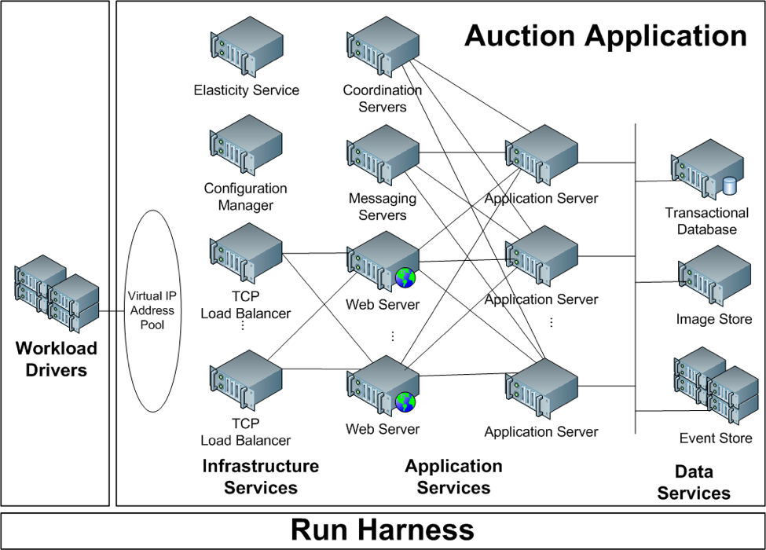

# Weathervane

## Overview

Weathervane is an application-level performance benchmark designed to allow the investigation of performance tradeoffs in modern virtualized and cloud infrastructures. It consists of an application, a workload driver that can drive a realistic and repeatable load against the application, and a run-harness that automates the process of executing runs and collecting results and relevant performance data. It can be used to investigate the performance characteristics of cloud and virtual infrastructures by deploying the application on the environment of interest, driving a load against the application, and examining the resulting performance metrics. A common use-case would involve varying some component or characteristic of the infrastructure in order to compare the effect of the alternatives on application-level performance.

## Warning

You should exercise caution and good judgement about where you deploy Weathervane.  Weathervane can place a significant load on system resources that can impact the performance of unrelated workloads.  As a result Weathervane is not intended to be used in production environments.  

In addition, the setup procedure for Weathervane may open ports or present other security issues that are not acceptable in many secure environments.  A Weathervane deployment is intended only for a performance test environment and may not be hardened sufficiently for all security requirements.  As a result, Weathervane should never be installed on virtual machines or OS instances that have been or may ever be deployed in a production environment, or that contain sensitive or personal information.  

## Getting Started

Weathervane runs on one or more hosts or virtual machines (VMs) running the Centos 7 operating system.  It includes a script to automate the initial configuration of the VM, including the installation of all necessary services.  Simple runs of the benchmark can be performed on a single VM, but the application and workload driver can be scaled out to perform benchmark runs involving dozens of VMs.

The process of setting up and running Weathervane is covered in detail in the [Weathervane User's Guide](weathervane_users_guide.pdf).  

## Documentation

The [Weathervane User's Guide](weathervane_users_guide.pdf) covers all aspects of installing, deploying, and running the Weathervane benchmark.

## Communicating about Weathervane

The Weathervane project team can be contacted in the following ways:

- [Slack](https://vmwarecode.slack.com/messages/weathervane): This is the primary community channel. If you don't have an @vmware.com or @emc.com email, please sign up at https://code.vmware.com/web/code/join to get a Slack invite.

- [Gitter](https://gitter.im/vmware/weathervane): Gitter is monitored but go to slack if you need a response quickly.

Feel free to contact us with questions or comments.  Please use these method to contact us for questions specific to your use of Weathervane.

We also encourage the use of Issues in the GitHub repository for any questions or suggestions that may be of general interest.  We may move discussion of questions or issues from Slack to a GitHub Issue if we feel that the question or answer may be of more general interest.  Before creating an Issue, please read [ISSUES.md](ISSUES.md).

## Issues

The Weathervane project encourages liberal use of Issues for bugs, feature requests, documentation shortcoming, or general questions.  Please read the issue guideline in [ISSUES.md](ISSUES.md) before filing an Issue.  Be sure to follow the guidelines regarding issue labels to ensure a prompt response.

## Releases & Major Branches

The branching and release strategy for Weathervane is discussed in [BRANCHING.md](BRANCHING.md).

## Contributing

The Weathervane project team welcomes contributions from the community. If you wish to contribute code and you have not
signed our contributor license agreement (CLA), our bot will update the issue when you open a Pull Request. For any
questions about the CLA process, please refer to our [FAQ](https://cla.vmware.com/faq). For more detailed information,
refer to [CONTRIBUTING.md](CONTRIBUTING.md).

## License

Weathervane is available under the the [BSD 2-clause "Simplified" License](LICENSE.txt).

Weathervane uses additional components which are downloaded when the project is built and which have additional licensing terms. The licenses for these components can be found in the [license file](LICENSE.txt).
