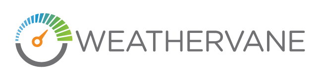

## Overview

Weathervane 2.1 is an application-level performance benchmark which lets you
investigate the performance characteristics of on-premise and cloud-based
Kubernetes clusters.

Weathervane tests the performance capabilities of a Kubernetes cluster by
deploying one or more applications on the cluster and then driving a load
against those applications.  The load is generated by the Weathervane workload
driver, which also runs on a Kubernetes cluster. Weathervane can be configured
to generate a steady load using a fixed number of simulated users, or to
automatically vary the number of users to find the maximum number that can be
supported on the cluster without violating quality-of-service (QoS)
requirements.

When using a fixed load, Weathervane will give a pass/fail result which
indicates whether the run completed without violating the QoS requirements.
When using the maximum finding feature, the result will be the largest number of
simulated users that could interact with the applications without violating the
QoS requirements.  This number is referred to as the peak WvUsers.

The application used by Weathervane is a multi-tier web application which
includes both stateless and stateful services. You can select from multiple
pre-tuned and tested configurations of this application.  The configurations
represent a range of deployment sizes. This allows you to select a configuration
based on the size of the cluster under test, or based on the expected usage of
the cluster.  Weathervane 2.1 includes multiple configuration sizes, and additional
configurations may be included in future releases.

## Warning

You should exercise caution and good judgment about where you deploy
Weathervane.  Weathervane can place a significant load on system resources that
can impact the performance of unrelated workloads.  As a result Weathervane is
not intended to be used in active production environments.

## Weathervane 2.1 vs 2.0

Users should not directly compare Weathervane 2.1 results to Weathervane 2.0 results due to some changes that alter performance.

Weathervane 2.1 changes include the use of pod affinity, enhanced workload driver
inter-node communication, improvements to data loading, and a number of other smaller updates and fixes.

## Previous Versions

Weathervane 1.x is still available on the 
[1.x branch](https://github.com/vmware/weathervane/tree/1.x).

## Getting Started

You can get started with Weathervane 2.1 by following the instructions in the 
[Quick Start Guide](doc/userDocs/usersGuide.md#quickstart-guide).

## Documentation

The [Weathervane User's Guide](doc/userDocs/usersGuide.md) covers all aspects
of setting up, deploying, and running the Weathervane benchmark.

## Communicating about Weathervane

The Weathervane project team can be contacted in the following ways:

- [Slack](https://vmwarecode.slack.com/messages/weathervane): This is the
  primary community channel. If you don't have an @vmware.com or @emc.com email,
  please sign up at https://code.vmware.com/web/code/join to get a Slack invite.

Feel free to contact us with questions or comments.  

We also encourage the use of Issues in the GitHub repository for any questions
or suggestions that may be of general interest.  We may move discussion of
questions or issues from Slack to a GitHub Issue if we feel that the question or
answer may be of more general interest.  Before creating an Issue, please read
[ISSUES.md](ISSUES.md).

## Issues

The Weathervane project encourages liberal use of Issues for bugs, feature
requests, documentation shortcoming, or general questions.  Please read the
issue guideline in [ISSUES.md](ISSUES.md) before filing an Issue.  Be sure to
follow the guidelines regarding issue labels to ensure a prompt response.

## Releases & Major Branches

The branching and release strategy for Weathervane is discussed in
[BRANCHING.md](BRANCHING.md).

## Contributing

The Weathervane project team welcomes contributions from the community. Before
you start working with Weathervane, please read our [Developer Certificate of
Origin](https://cla.vmware.com/dco). All contributions to this repository must
be signed as described on that page. Your signature certifies that you wrote the
patch or have the right to pass it on as an open-source patch. For more detailed
information, refer to [CONTRIBUTING.md](CONTRIBUTING.md).

## License

Weathervane is available under the the [BSD 2-clause License](LICENSE.txt).
