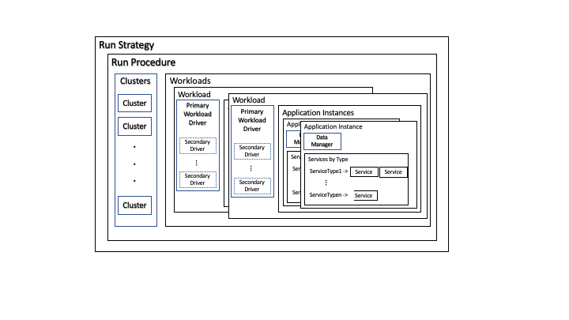

# Weathervane Run Harness Developer Documentation

## Design and Implementation Overview

## Run Life-Cycle

## Key Concepts

### Parameters

### Run Strategies

### Run Procedures

### Workloads and Workload Implementations

### Services

#### Service Tiers

#### Service Types

#### Service Implementations

### The WeathervaneTypes.pm file: Defining the relationships among workloads, tiers, types, and implementations

### Compute Resources

### Data Managers

### Virtual Infrastructures

### Workload Drivers

## Creating Entities: The Factories

## Adding Parameters

## Adding a new Workload/Application

### Overview

- Add Workload Driver Sub-Class
- Add AppInstance Sub-Class
- Add Data Manager Sub-Class
- Add Required Types and Services
- Add Services
- Add Docker Image Directory and update buildDockerImages.pl
- Add Config Files for Services
- Add Service Sub-Classes

## Adding new types of clusters/hosts

## Adding a New Run Strategy

## Adding a New Run Procedure

## Known Issues and Shortcomings

### Perl-Related Issues

#### No Threads

Can't spawn threads, only processes.  This causes problems when you want to do work in parallel and return state.  

## Possible Run Harness Futures