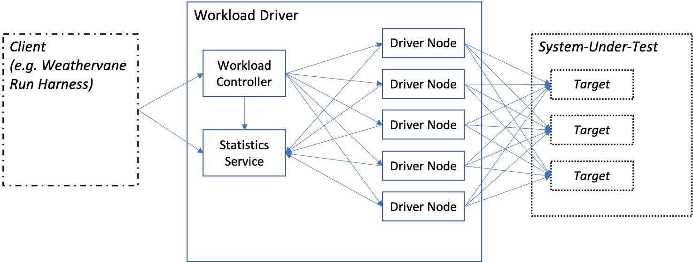

# Weathervane Workload Driver Developer Documentation

## Design and Implementation Overview

The Weathervane workload driver is a general purpose HTTP/HTTPS load driver.  In the Weathervane benchmark it is used to drive load against a system by simulating users interacting with the Auction application.  It can also be used to drive load against other applications.

The figure below shows a high-level view of the workload driver and its relationships with external systems.  The components shown and their roles are as follows:
- **Client**: The client is the external application or interface that is used to configure and start runs of a benchmark.  The client may also retrieve and process the results of a run.  In Weathervane, the role of the client is filled by the Weathervane run harness.  However, the client could be a different application, or a user interface custom designed for the workload driver.
- **Workload Driver**: The workload driver consists of the workload controller, the statistics service, and any number of driver nodes.  In Weathervane the workload controller and statistics service are run in the same Java runtime.  However, it is possible to deploy these services separately.
    - **Workload Controller**: The workload controller is the component that manages and tracks all current benchmark runs.  It has a REST interface that can be used by the client to set up, control, and check the status of runs. It contains the active components that control the behavior of the driver nodes during a run. More detail is given in the section [Workload Controller](#workload-controller).
    - **Statistics Service**: The statistics service is used to track operation-level statistics gathered during the course of a run.  At the end of each statistics interval, the driver nodes send their statistics to the statistics service.  The statistics service performs a number of operations on the data, such as combining all statistics for particular targets and workloads, calculating pass/fail and related statistics for the Quality-of-Service (QoS) metrics, writing report and csv files, and storing the data for retrieval by the client.  The statistics service has a REST interface which is used by the driver nodes to post data, and the client and workload controller to retrieve data. More detail is given in the section [Statistics Service](#stats-service).
    - **Driver Node**: The driver nodes run the simulated users that interact with the system-under-test (SUT).  The behavior of an individual simulated user is controlled by the pre-defined benchmark workload (more detail is given in the section [Benchmarks](#benchmarks)). The number of active simulated users is controlled by messages from the workload controller.  Each driver node will drive load to all targets (HTTP/HTTPS endpoints) on the SUT. More detail is given in the section [Driver Node](#driver-node). 
- **System Under Test**: The system under test (SUT) represents the amalgam of the application on which load is being driven and the infrastructure on which the application runs.  It is the performance of this amalgam that is tested by a benchmark run.  The application running on the SUT may have multiple HTTP/HTTPS endpoints through which the simulated users can interact with the application.  The workload driver refers to these are *targets*, and will evenly distribute the load for a workload over all defined targets for the run.
    
    
 

Some key features of the workload driver are:

- It is extensible for use with new applications (i.e. it does not only work with the Weathervane Auction workload)
- The load generation process for a benchmark:
    - Can be data-driven, i.e. the next operation to be performed can depend on data retrieved by a previous operation
    - Can simulate workloads that incorporate multiple asynchronous behaviors for a single user, such as those generated by browser applications with asynchronous Javascript operations.
- Workloads can include Quality-of-Service (QoS) requirements in the following categories
    - Per-operation response-time
    - Per-operation failure rate
    - Operation mix percentage (with an allowed tolerance)
- Can run multiple benchmark runs simultaneously using the same set of workload driver nodes (this capability is not currently used by Weathervane). 
- Provides a REST API that allows the workload driver to be controlled by an external client application

## Key Terms

This section is a glossary of key terms used in the workload driver code and REST API.  The usage of these terms often does not match the name used for an equivalent concept in the Weathervane run harness, so it is important to review these terms before reading the remainder of the document.

- **Run**: A Run represents a single load-generation test in which load is driven against a set of Workloads.  The lifecycle of a run can be controlled through the REST API.
- **Workload**: A Workload represents the driving of load against a set of Targets using a specific Benchmark, BehaviorSpec, and LoadPath type.  A Workload drives the load for what is referred to in Weathervane as an Application Instance.  Thus a Run which contains multiple workloads will be driving load against multiple application instances.  A representation of an active Workload exists on the Workload Controller as well as on all of the Driver Nodes.
- **Target**: The endpoint against which load is driven.  A Workload may contain multiple Targets.  Currently the number of active Users for a Workload is divided evenly among all Targets.
- **Benchmark**: The term Benchmark refers to the set of Operations, TransitionChoosers, and other classes that must be created in order to implement a workload for a new application.  There is no Benchmark class, but all of the classes for a Benchmark will live in a Java package below the `com.vmware.weathervane.workloadDriver.benchmarks` package.  For example, the classes that implement the auction benchmark used by Weathervane are located below the `com.vmware.weathervane.workloadDriver.benchmarks.auction` package.  Note that the classes in a Benchmark do not define the flow between operations when running a Workload, or things like the QoS metrics.  That information is contained in a BehaviorSpec.
- **BehaviorSpec**: A BehaviorSpec is a JSON file that defines, among other things: the initial operation for a simulated User; the probability of each next Operation given the current Operation; the values for the QoS metrics; whether an Operation spawns an asynchronous behavior; etc.  There can be many different BehaviorSpecs for a given Benchmark, each defining a different load pattern for the workload.  BehaviorSpecs must be posted to the Workload Controller by the Client before adding a Run that uses them.  
- **LoadPath**: A LoadPath controls the number of Users that should be running in a Workload at any given time.  The workload driver currently supports a number of LoadPath implementations that use different methods for determining the appropriate number of active Users.  For example, the FixedLoadPath ramps the load up to a pre-selected nymber of Users, runs for a pre-selected number of QoS periods, and then exits.  The FindMaxLoadPath uses results from previous QoS periods to adjust the load in order to find the maximum number of Users that can be supported.  The LoadPaths, together with the LoadPathControllers, implement the RunStrategies used by the Weathervane benchmark.
- **LoadPathController**: A LoadPathController coordinates interval transitions among the LoadPaths in a Run with multiple Workloads.  The way that the transitions are coordinated is entirely up to the implementation of the LoadPathController. For example, the SyncUntilHalfFailThenAsyncLoadPathController forces all loadPaths to treat their previous interval as having passed if at least half of the Workloads in the Run passed the previous interval, but once this has happened each LoadPath uses the actual result for its Workload.  Using this LoadPathContoller in combination with the FindMaxLoadPath enables the ramp-up periods of the Workloads to stay in sync until half of the Workloads fail QoS, at which point each workload finds its maximum independently.  This combination is used to implement the FindMaxSingleRun RunStrategy used by the Weathervane run harness.
- **StatsInterval**:
- **StatsCollector**:
- **Operation**:
- **TransitionChooser**:
- **Behavior**:
- **User**:

## Component Breakdown

This section 

## Run Life-Cycle

## Workload Controller

## Statistics Service

## Driver Node

## Benchmarks

## Future Improvements

For those wanting to improve the workload driver, here are some ideas.  This is just a small list out of an endless set of possibilities.

- Simplify the addition of new workloads: Currently it is difficult to add additional applications to the workload driver.  Driving load for a new application requires a combination of Java coding (adding a Benchmark with Operations, TransitionChoosers, etc) and creating BehaviorSpec JSON files, which describe the Operation transition metrix, the QoS metrics, etc. for the workload.  In particular, the Java coding part is complicated and requires detailed knowledge of the operation of the workload driver.  It should be possible to replace the Java coding with textual or graphical definition of a Benchmark and its workload with proper design of generic classes for the components plus an appropriate user interface.  This would greatly improve the general usability of the workload driver.
- Add a User Interface: The workload driver provides REST APIs that can be used by client to control benchmark runs.  However, it should also be possible to create a web-based user interface to configure and start benchmark runs.  This would be particularly useful when using the workload driver outside of Weathervane.  
- Replace the statistics service with a time-series database, such as Prometheus: The statistics service, as currently implemented, is not as optimized or full-functioned as a time-series database.  It has no ability to store data from old runs, does not support customs queries over the data, and has no support for data vizualization.  Replacing it with Prometheus/Grafana (or similar) would significantly improve the general usability of the workload driver, and would make it much more applicable to use with other applications.
- Add the ability to use different targets (HTTP/HTTPS endpoints) for different operations.
- Add support for HTTP2.  This would require updating the HttpTransport and related classed, which use Netty to implement the HTTP client.
- Extend support to different types of Targets, such as storage devices, network, etc.  Currently only HTTP Targets are supported.

## Code Overview

## Known Issues and Shortcomings

