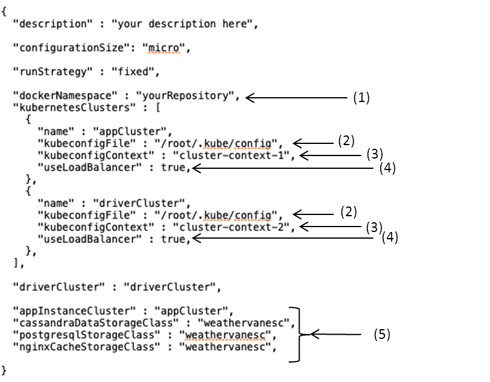

# Weathervane 2.1 User's Guide
Contents:
- [Introduction](#intro)
- [QuickStart Guide](#quickstart-guide)
    - [Prerequisites](#quickstart-prereq)
- [Detailed Setup](#setup)
    - [Configuring Kubernetes Cluster(s)](#configuring-clusters)
    - [Configuring a Client](#configuring-client)
- [Using Weathervane](#using)
- [Configuration File Details](#config)
- [Run Output Details](#output)
- [Troubleshooting](#troubleshooting)
- [Advanced Topics](#advanced)
- [Running on Specific Cluster Types](#specific)
- [Appendices](#appendices)


## Introduction<a name="intro"></a>

### Overview

Weathervane 2.1 is an application-level performance benchmark which lets you
investigate the performance characteristics of on-premise and cloud-based
Kubernetes clusters.

Weathervane tests the performance capabilities of a Kubernetes cluster by
deploying one or more applications on the cluster and then driving a load
against those applications.  The load is generated by the Weathervane workload
driver, which also runs on a Kubernetes cluster. Weathervane can be configured
to generate a steady load using a fixed number of simulated users, or to
automatically vary the number of users to find the maximum number that can be
supported on the cluster without violating quality-of-service (QoS)
requirements.

When using a fixed load, Weathervane will give a pass/fail result which
indicates whether the run completed without violating the QoS requirements.
When using the maximum finding feature, the result will be the largest number of
simulated users that could interact with the applications without violating the
QoS requirements.  This number is referred to as the peak WvUsers.

The application used by Weathervane is a multi-tier web application which
includes both stateless and stateful services. You can select from multiple
pre-tuned and tested configurations of this application.  The configurations
represent a range of deployment sizes. This allows you to select a configuration
based on the size of the cluster under test, or based on the expected usage of
the cluster.  Weathervane 2.1 includes multiple configuration sizes, and larger
configurations will be included in future releases. More details about the
application are included in the [appendix](#architecture).

Weathervane also includes a run harness that automates the process of executing
runs and collecting results.  The run harness can run on any client system that
supports Docker containers and that has connectivity to the Kubernetes clusters.

### Quality-of-Service Requirements

Weathervane enforces three types of QoS requirements on the operations performed
by the simulated users.  These QoS requirements are tested over a five minute
measurement period. The requirements are:
- Response-Time: 99% of all operations in each operation type must 
complete within that operation's response-time limit.
- Operation Mix: Each operation type must make up a predefined proportion of 
the overall operation mix. 
- Failure Percentage: Less than 0.5% of operations can experience a functional
failure.

### Performance Metrics

The primary metric from Weathervane is WvUsers.  This metric represents the
maximum number of simulated users that could interact with the application
instances without violating the QoS requirements. When running the same
deployment configuration on two different Kubernetes clusters, the cluster that
supports a higher WvUsers can be considered to be the higher performing cluster.

Weathervane also reports the average response-time for user operations.  For
systems running at identical WvUsers, the average response-time can be used to
compare the performance of different clusters.

Weathervane also reports throughput in terms of operations/second and
HTTP-requests/second, but these metrics do not add additional information over
WvUsers. As long as the QoS requirements are not violated, each WvUser drives a
fixed amount of throughput in terms of both operations-per-second and
HTTP-requests/sec.  As a result, there is a direct correlation between WvUsers
and throughput.


### Weathervane 2.1 vs 2.0

The changes in Weathervane 2.1 may be significant enough to slightly alter 
the performance results vs Weathervane 2.0 baselines.  It is advised not to directly 
compare results for the two verions of the benchmark.
These changes include the use of [pod-affinity](#pod-affinity), enhanced workload driver
inter-node commuication, improvements to data loading, and a number of other smaller updates and fixes.

## Quickstart Guide<a name="quickstart-guide"></a>

This section is intended to get users up and running using Weathervane 2.1 with a minimal set of instructions.
More detailed [instructions](#setup) are included in later sections.

### Prerequisites<a name="quickstart-prereq"></a>

Weathervane requires at least one existing Kubernetes cluster and a client system.
- Kubernetes cluster:
    - You must have a kubeconfig file with [credentials](#credentials) for the cluster.
    - There must be at least one [StorageClass](#storageclass) defined on the cluster.
        - A StorageClass Provisioner might have prerequisites and configuration [steps](#storageclass-prereq).
- Client system:
    - Configure a workstation (MacOS or Linux) or a Linux VM with the required software:
        - Perl 5 (https://www.perl.org/get.html)
        	- The module for Term::ReadKey should be installed.
        - Docker Engine (https://docs.docker.com/install/)
        - Git (https://git-scm.com/downloads)
        - The `unzip` utility
        - The kubeconfig file must be accessible by this client system.

### Quickstart Setup<a name="quickstart-setup"></a>

#### Obtain Weathervane from GitHub

1. Clone the Weathervane repository to the client system:
    * `git clone https://github.com/vmware/weathervane`
    * This will create a directory called weathervane in the current directory.
1. Change into the weathervane directory:
      - `cd weathervane`


#### Create the Weathervane Docker Images

Using the included `buildDockerImages.pl` script, build the Docker images for the Weathervane components 
and place them on a Docker registry that is accessible from your Kubernetes clusters.

The process using a Docker Hub account is as follows:
- Make sure you are in the weathervane directory and run the script:
    * `./buildDockerImages.pl --username yourUserName`
        * Replace *yourUserName* with your Docker Hub username.
        * The script will prompt for your Docker Hub password.
        * This process can take as long as an hour to complete.

Additional details for this script are documented [here](#building), including instructions to enable the use of a private Docker repository.


#### Create the Weathervane Configuration File<a name="quickstart-config"></a>
Create a file to contain your unique configuration settings by first duplicating an included config file in the weathervane directory:
* `cp weathervane.config.k8s.micro weathervane.config.k8s.quickstart`

This example file runs a very small configuration of the Weathervane application using a fixed runStrategy.
It will attempt a run with 200 users that will take about 45 minutes to complete, including about 15 minutes to load the data -- a process that should only occur on the first run.

The image below shows the lines that need to be edited in the configuration file:


1. Replace `yourRepository` with your Docker Hub username or the hostname and port of your private Docker registry.
2. Update *kubeconfigFile* to the full path to your kubeconfig file.  The paths will be identical if using a single cluster for both the app and driver.
3. Update *kubeconfigContext* parameters with the name of the context for your cluster from the kubeconfig file, such as `kubernetes-admin@kubernetes`.
    - Set an empty string (`""`) to use the current-context defined in the kubeconfigFile.
4. Choose a value for *appIngressMethod* that reflects the method you want to use
  for communication between the workload drivers and the applications. You can choose 
  from among:
    - `loadbalancer`: Traffic from the workload drivers to the applications will
          use the external IP address of a Kubernetes LoadBalancer service. This 
          may be desirable even when the workload drivers and applications are running 
          on the same cluster in order to load-test the complete networking 
          stack of your cluster. The cluster on which the applications run must 
          support provisioning external IP addresses for LoadBalancer services. 
    - `nodeport`: Traffic from the workload drivers to the applications will
          use the *external* IP addresses of the Kubernetes Nodes via a NodePort service. This 
          may be desirable even when the workload drivers and applications are running 
          on the same cluster in order to load-test the complete networking 
          stack of your cluster. The cluster on which the applications run must 
          support exposing the node IP addresses externally using NodePort services.
    - `nodeport-internal`: Traffic from the workload drivers to the applications will
          use the *internal* IP addresses of the Kubernetes Nodes via a NodePort service. This 
          may be desirable even when the workload drivers and applications are running 
          on the same cluster in order to load-test the complete networking 
          stack of your cluster. If the workload drivers are running in a different 
          cluster than the applications, then the internal IP addresses must be routable 
          from outside the SUT cluster.
    - `clusterip`: Traffic from the workload drivers to the applications will use a 
          cluster internal address provisioned by a Kubernetes ClusterIP service.  This 
          choice will only work if the workload drivers and applications are running 
          on the same cluster.
  
5. Update *StorageClass* parameters with the names of one or more storage classes defined on your cluster.

Notes:
- If your platform does not support creating namespaces using kubectl, then you must create the namespaces manually before the run. 
  The workload drivers run in namespace `auctionw1`. The application runs in namespace `auctionw1i1`. For 
  more information on configuring namespaces, including using specific namespace names, 
  see [Configuring Namespaces](#namespaces) below.

More details on the configuration file are available [here](#config).

### Quickstart Run

To run Weathervane, issue the following command in the weathervane directory and use the configuration file created above:
* `./runWeathervane.pl --configFile=weathervane.config.k8s.quickstart`

When you invoke this script for the first time, you will be prompted to accept the license terms for Weathervane.

### Examine the Output

As Weathervane runs it will print progress messages to the screen. 
Once the run completes, all output files will be copied to a sub-directory under *weathervane/output*.
More details about the output are located [here](#output).

The primary result from Weathervane run with the fixed runStrategy is a pass/fail decision for the selected number of users.

### Cleaning Up

In order to avoid reloading the data for every run,
Weathervane leaves certain data in place on the persistent storage configured with the *StorageClass* parameters.
Once the data is no longer needed, these should be properly [cleaned](#cleaning-up-persistent-storage) up.

### Next Steps

This is the end of the quickstart section. More details for [setup](#setup) and [using](#using) Weathervane are located in the following sections.

## Detailed Setup Instructions<a name="setup"></a>

### Prerequisites<a name="prereq"></a>

For a summary of prerequisites, refer to the [prerequisites](#quickstart-prereq) section in the Quickstart Guide .

### Configuring Kubernetes Cluster(s) for Weathervane<a name="configuring-clusters"></a>

#### Overview

The Weathervane 2.1 application and driver components require at least one Kubernetes cluster to run on.

For most uses of Weathervane 2.1, the workload driver pods should run on different compute resources than the application pods.
Depending on your available resources and the goals of your tests, this may be done in two ways:
1. By partitioning the worker nodes of a single cluster into driver and system-under-test 
   (SUT) nodes using [nodeLabels](#nodeLabels).
2. By using two Kubernetes clusters with the config file parameters driverCluster and appCluster.

#### Kubernetes Cluster Credentials<a name="credentials"></a>

You must have kubeconfig file(s) with credentials for the cluster(s).
- If you are running on a cloud-based Kubernetes cluster, see the documentation from your cluster provider for instructions on retrieving the credentials. Typically the credentials will end up in the file ~/.kube/config.
- If you are running on a Kubernetes cluster created for you, you may need to contact the cluster administrator for the cluster credentials.
- If you configured your own cluster using kubeadm, the credentials will be in the file /etc/kubernetes/admin.conf.

In all cases you will need to copy the credentials file to your client system.

Handling clusters whose credential expire is discussed [below](#expire).

When using both a driverCluster and appCluster, you can use separate kubeconfig files for each cluster,
or use one file with multiple contexts. More information about using multiple contexts in a kubeconfig file is located at (https://kubernetes.io/docs/concepts/configuration/organize-cluster-access-kubeconfig/).

#### Configuring Driver to Application Communication<a name="appingressmethod"></a>

The Weathervane workload driver interacts with the Weathervane application through a Kubernetes service fronting the application's web-server 
tier. Weathervane 
allows the user to select the type of Kubernetes service to be used.  Your selection will depend 
on the types of services supported by your cluster and the goals of your tests.  

Weathervane supports the use of 
[LoadBalancer, NodePort, or ClusterIP services](https://kubernetes.io/docs/concepts/services-networking/service/#publishing-services-service-types).   You 
indicate the type of service you want to use by setting the *appIngressMethod* parameter 
to `loadbalancer`, `nodeport`, `nodeport-internal`, or `clusterip`.  The default value 
for this parameter is `loadbalancer`.  The `nodeport` and `nodeport-internal` options 
differ in that `nodeport` uses the external IP addresses of the nodes, while `nodeport-internal` 
uses the internal IP addresses.  Note that clusters created manually using kubeadm 
will likely not support LoadBalancer services.  In that case you will need to use either 
NodePort or ClusterIP services.

When you are running the workload drivers and applications on separate clusters, you 
can choose between LoadBalancer and NodePort services.  Most 
clusters will support at least one of these ingress methods, and some may support both.
You will need to check the documentation for your cluster to determine which is supported. If 
using LoadBalancer services is the typical ingress method for your cluster, then you 
should use LoadBalancer services in order to ensure that your performance tests include 
the entire network stack.  When using NodePort services with the `nodeport` value for 
`appIngressMethod`, the network traffic between 
the drivers and applications is routed directly to the external IP addresses of the 
Kubernetes nodes, and does not use any LoadBalancers provisioned by your infrastructure. 
If using NodePort services with the `nodeport-internal` value for 
`appIngressMethod`, the network traffic between 
the drivers and applications is routed directly to the internal IP addresses of the 
Kubernetes nodes.  In this case you may need additional network support to route traffic 
to the internal addresses.

Please note that depending on your cluster provider there may be a monetary cost associated 
with LoadBalancer services. Check with your provider for more details.

When you are running the workload drivers and applications on the same cluster, you 
can choose among ClusterIP, LoadBalancer, and NodePort services.  With ClusterIP services 
the network traffic will be directed to IP addresses internal to the cluster, and will 
not require externally visible addresses.  This may simplify deployment in some cases, 
but it will not stress the parts of the network stack that manage directing traffic 
from external to internal addresses.  If the performance of those components is important, 
you should use either LoadBalancer or NodePort services.

#### Configuring Namespaces<a name="namespaces"></a>

Weathervane runs each instance of the Auction application in a separate namespace. The 
workload drivers also run in their own namespace.  The default names for the application 
namespaces are __auctionw1i*n*__, where __*n*__ is the application's instance number.  The default 
name for the workload driver namespace is __auctionw1__.  Weathervane will try 
to create these namespaces if they don't already exist.

While the default namespace names will work for most clusters, there are situations 
where you would want to customize namespace names. :
* You are using Weathervane to perform tests with multiple configuration sizes on the 
  same cluster.  Specifying a unique namespace suffix for each configuration size will 
  prevent Weathervane from reloading the data services when switching among sizes.
* The namespace names on your cluster must adhere to specific conventions
* The namespaces on your cluster are created and named by an administrator
* The namespaces on your cluster are created and named by an automated provisioning 
  system 

It is possible to customize the generation of namespace names for each Kubernetes 
cluster specified in your configuration file. It is also possible to explicitly 
specify a list of namespace names that should be used for each cluster. In addition, 
you can control whether Weathervane should try to create the namespaces. Instructions 
for configuring namespace names can be found in the [Advanced 
Topics](#advanced-namespaces) section.  

#### Configuring Persistent Storage<a name="storageclass"></a>

The Weathervane Auction application requires data be loaded into the data
services before a run can be performed. This data includes user accounts,
auction and item data, item images, and historical event data regarding bids
and auction attendance.

There must be at least one [StorageClass](#storageclass) defined on the application cluster to be used for this persistent storage.
Examples for different storage providers are available at this link (https://kubernetes.io/docs/concepts/storage/storage-classes/).  
A StorageClass Provisioner might have prerequisites and configuration [steps](#storageclass-prereq).

In the Weathervane config file, there are multiple *StorageClass* parameters that should be updated with names defined on your cluster.
All services may use the same StorageClass, or you can use a different StorageClass for each service.

Size requirements per instances are noted in the configuration size [tables](#configuration-sizes).

Loading the data can be time consuming, and is done at the beginning of a run if not already completed.

Here are some time estimates for loading a single application instance:
- A micro configuration with 3,000 users takes about 15 minutes.
- An xsmall configuration with 12,000 users takes about 30 minutes.
- A small2 configuration with 16,000 users takes about 50 minutes.
- A small2-applimit2 configuration with 25,000 users takes about 80 minutes.

##### StorageClass Provisioner Prerequisites and Configuration<a name="storageclass-prereq"></a>
Ensure that all prerequisites and configuration steps are completed for your chosen StorageClass Provisioner.  
For example, when using vSphere Storage for Kubernetes, details are available at this link (https://vmware.github.io/vsphere-storage-for-kubernetes/documentation/).

##### Cleaning Up Persistent Storage<a name="cleaning-up-persistent-storage"></a>

In order to avoid reloading the data for every run, Weathervane leaves this data in place on the persistent storage.
On subsequent runs, Weathervane reuses the loaded data by restoring it to the original state.

Once the data is no longer needed, such as when no more Weathervane runs will be performed, the persistent storage should be properly cleaned up,
even if you plan to delete the clusters under test.

The command below will delete all of the PersistentVolumeClaims created by Weathervane:
* `kubectl delete pvc --selector=app=auction --all-namespaces`


### Configuring a Client for Weathervane<a name="configuring-client"></a>

#### Overview

Weathervane requires a client system to build the container images and to execute the run harness.

#### Required Software

The following set of software should be installed on the client:
- The Weathervane scripts are written in Perl:
    - Perl 5 (https://www.perl.org/get.html)
- The run harness container will be run on the client using docker:
    - Docker Engine (https://docs.docker.com/install/)
- The Weathervane repository can be cloned using git:
    - Git (https://git-scm.com/downloads)
    - Optionally, the repository can be manually downloaded and extracted.
- The kubeconfig file containing the kubernetes cluster context information must be accessible by this client system.


#### Obtaining Weathervane<a name="obtaining"></a>

The Weathervane repository is located on GitHub.

It can be cloned using git or downloaded and extracted.
Cloning is suggested as it will allow easy updates to newer versions:
1. Clone the Weathervane repository to the client system:
    * `git clone https://github.com/vmware/weathervane`
    * This will create a directory called weathervane in the current directory.
1. Change into the weathervane directory:
    - `cd weathervane`


#### Building and Storing the Weathervane Images<a name="building"></a>

Weathervane uses Docker images for all of its components, including the run 
harness, the workload driver, and all services used by the Weathervane Auction 
application.  These images must be built and pushed to an image repository that 
is accessible to the Kubernetes clusters and the client.

Weathervane includes a script to build the images and push them to
either a Docker Hub account or a private Docker repository.
This script should be run from the weathervane directory.

The process using a Docker Hub account is as follows:
* `./buildDockerImages.pl --username yourUserName`
    * Replace *yourUserName* with your Docker Hub username.
    * The script will prompt for your Docker Hub password.


The process using a private repository is as follows:
* `./buildDockerImages.pl --private --host hostname`
    * Replace *hostname* with the hostname or IP address of the private registry.
    * If your registry is not running on the default port 5000 or requires a username for authentication, these can be specified as follows:
        * `./buildDockerImages.pl --private --host hostname --port 5001 --username yourUserName`
        * The script will prompt for password.

If yourUserName contains special characters, such as the $ sign, wrap yourUserName in single quotes so it is passed as intended to the script.

The process to build and push the images can take as long as an hour to complete.

## Using Weathervane<a name="using"></a>

### Overview

This section is a task-oriented guide to using Weathervane.  Each 
section discusses the steps required to achieve a specific goal.  The tasks in 
this chapter all assume that you have performed a run using the instructions in
the [QuickStart](#quickstart-guide) section.

In this section, the term system-under-test (SUT) is used to refer to the 
collection of resources on which the Weathervane application runs.  This may
be an entire Kubernetes cluster, or a set of worker nodes isolated using
[node labels](#nodeLabels).

The tasks discussed in this section are:
- [Change the Number of WvUsers](#task-change)
- [Find the Maximum WvUsers for a Configuration](#task-max)
- [Increase the Load on the SUT: Add Application Instances](#task-moreinstances)
- [Increase the Load on the SUT: Larger Application Instances](#task-largerinstances)
- [Perform an Extended Duration Run](#task-extended)
- [Perform a Run with Varying Load](#task-varying)
- [Perform a Run that Doesn't End](#task-forever)
- [Perform a Series of Runs](#task-series)
- [Cleanly Stop an Ongoing Run](#task-stop)
- [Clean up a Cluster when Finished](#task-clean)

### Change the Number of WvUsers<a name="task-change"></a>

#### Task Goal

This task shows how to change the number of WvUsers used to create load on the
SUT when using the `fixed` run strategy.

The run performed in the [QuickStart](#quickstart-guide) section used the `fixed`
run strategy with the default number of users.  For the micro configuration the 
default is 200 WvUsers.  If the run failed, you may wish to reduce the load on 
the SUT by reducing the number of WvUsers.  If it passed, you may wish to 
increase the number of WvUsers.

#### Instructions

With the `fixed` run strategy, you can change the load on the SUT by specifying
the number of users in your configuration file.  

The number of users specified must be less than or equal to the maximum number 
of users loaded for the selected configuration size.  
* For the `micro` configuration, maxUsers is `3000` users. 
* For the `xsmall` configuration, this is `12000` users.
* For the `small2` configuration, this is `16000` users.
* For the `small2-applimit2` configuration, this is `25000` users.

To change the number of users, edit the configuration file as follows:

1. Add the following line: `"users" : 500,`, replacing `500` with the number of 
   users you wish to use.
1. Optionally, change the description parameter to properly describe the run.
1. Optionally, save the configuration file by a different name to reflect the contents.

Then run Weathervane as before with the new configuration file.

### Find the Maximum WvUsers for a Configuration<a name="task-max"></a>

#### Task Goal

This task shows how to configure Weathervane to automatically find the maximum 
WvUsers that can be supported by the configuration described in the configuration
file.

The `fixed` runStrategy used in the [QuickStart](#quickstart-guide) section gives a 
pass/fail result for a fixed number of users.  Finding the maximum number of 
users with the `fixed` run strategy may require a large number 
of runs.  An alternative is to use the `findMaxSingleRun` run strategy.  With 
this run strategy, Weathervane will automatically vary the load in order to 
discover the maximum number of users supported on the SUT by the given 
configuration.  

#### Instructions

To use the `findMaxSingleRun` run strategy, edit the configuration file as 
follows:

1. In the configuration file change the value for the `runStrategy` to 
   `findMaxSingleRun`.
1. Optionally, change the description parameter to properly describe the run.
1. Optionally, save the configuration file by a different name to reflect the contents.

Then run Weathervane as before with the new configuration file.  The output from
the run will be the maximum WvUsers that could run against the deployed 
configuration and still meet the QoS requirements.

### Increase the Load on the SUT: Add Application Instances<a name="task-moreinstances"></a>

#### Task Goal

This task shows how to increase the load on the SUT by adding additional 
instances of the Weathervane Auction application.

In many cases, a running only a single instance of the Weathervane application
will not place sufficient load on the SUT to max out the available resources.
This is because the CPU and memory resources used by an instance of the auction 
application are fixed, and may be less than the resources available on the SUT.
To increase the load on the SUT, you can run multiple copies of the Auction 
application in 
each run. Each copy is referred to as an application instance. Increasing the 
number of application instances will increase the load on the SUT.  The 
number of application instances is limited only by the CPU, memory, and storage 
resources of your cluster. The [Configuration Sizes](#configuration-sizes) section
below discusses the resources used by each configuration size.

When you run the `findMaxSingleRun` run strategy (see [above](#task-max)) with 
multiple application instances, Weathervane will vary the load on 
the instances until all have reached a maximum load.  It will then report the 
maximum passing load for each individual instance and the total load supported 
by the cluster. Increasing the number of application instances until the total 
load ceases to increase will give you the peak capabilities of the cluster.

Note that each time a new application instance is used, the data will need to 
be pre-loaded for the stateful services.  This will increase the time required
for the first run with a new number of application instances.

#### Instructions

To change the number of application instances, edit the configuration file as 
follows:

1. Add the following line: `"numAppInstances" : 2`, 
    - Replace the `2` with the number of instances you wish to run.
1. Optionally, change the description parameter to properly describe the run.
1. Optionally, save the configuration file by a different name to reflect the contents.

Then run Weathervane as before with the new configuration file.

**Note:**

- Each application instance will run in a separate namespace.  For n 
  application instances, the namespaces will be called `auctionw1i1` through 
  `auctionw1in`.  If your platform does not support creating namespaces using 
  kubectl, then you must create these namespaces manually before the run. See [Configuring 
  Namespaces](#namespaces) for more detail.

### Increase the Load on the SUT: Larger Application Instances<a name="task-largerinstances"></a>

#### Task Goal

This task shows how to increase the load on the SUT by using a larger 
configuration size for your application instances.

Weathervane currently supports multiple configuration sizes for the Auction 
application: `micro`, `xsmall`, `small2`, and `small2-applimit2`. 
Additional sizes will be added in future releases. Each size corresponds to a fixed 
configuration of the Weathervane Auction application and an appropriate number of workload 
driver nodes.  Larger configurations will support a large user load, and may come closer to 
maxing out the capabilities of your cluster. A different configuration size 
may also be more representative of production applications to be deployed on 
the SUT.  More detail about the configuration sizes is given in 
the [Configuration Sizes](#configuration-sizes) section below.

Note that the different configuration sizes require different amounts of data
to be pre-loaded, and specify different sizes for the persistent volumes used
by the stateful services.  As a result, changing the configuration size will 
cause existing persistent volumes to be deleted and require the data to be 
reloaded for any previously used instances.

#### Instructions

To use a different configuration size, edit the configuration file as follows:

1. Change the value for the `configurationSize` to `micro`, `xsmall`, `small2`, or `small2-applimit2`.
1. Optionally, change the description parameter to properly describe the run.
1. Optionally, save the configuration file by a different name to reflect the contents.

Then run Weathervane as before with the new configuration file.

### Perform an Extended Duration Run<a name="task-extended"></a>

#### Task Goal

This task shows how to run Weathervane for an extended duration. 

The default duration of a run using the `fixed` run strategy is sixteen minutes. 
This consists of a four minute ramp-up period, a five minute warm-up period, a 
single five minute QoS period, and a two minute ramp-down period. Compliance 
with the QoS requirements is checked in the QoS period.

There may be times when it is desirable to run Weathervane for an extended 
duration.  For example, you may wish to perform an extended load test of
a cluster, or to observe the effects of changes made to the SUT while the 
Weathervane is running.  You can do this using the `fixed` run strategy by 
adding additional QoS periods. 

#### Instructions

To run using the `fixed` run strategy with a larger number of QoS periods, 
edit the configuration file as follows:

1. Add the following line: `"numQosPeriods" : 2`, 
    - Replace the `2` with the number of QoS periods you wish to use.
    - Each additional QoS period adds five minutes to the run. 
        - For example, to run for 24 hours, or 24*60 = 1440 minutes, 
          you would need 1440/5 = 288 QoS periods.  In this case you would 
          specify the value `288` for `numQosPeriods`. 
1. Optionally, change the description parameter to properly describe the run.
1. Optionally, save the configuration file by a different name to reflect the contents.

Then run Weathervane as before with the new configuration file.

### Perform a Run with Varying Load<a name="task-varying"></a>

#### Task Goal

This task shows how to perform a run in which the load placed on the application
instances varies over the course of a run according to a predefined load path.

In addition to the `fixed` and `findMaxSingleRun` run strategies discussed in
previous sections, Weathervane provides an `interval` runStrategy in which you
can specify the manner in which the load should be varied over the course of a
run.

The `interval` runStrategy has two main parameters that control the behavior of
a run:

1. `runDuration` : This controls how long Weathervane will run, in seconds. The
default value for this parameter is 1800.
1. `userLoadPath` : This specifies a list of intervals of fixed duration. Within
each interval the number of users either ramps up or down between start and end
values, or takes a fixed value. 

During a run with the `interval` runStrategy, the load driven to the application
instances will change according to the intervals specified in the userLoadPath.
The intervals are used in the order in which they are specified.  If the
`runDuration` is longer than the sum of the durations of the intervals, then,
starting at the first interval, the userLoadPath will repeat the intervals in
the `userLoadPath` until the run completes. If this is not the desired behavior,
the `repeatUserLoadPath` parameter can be set to `false` to cause the load to
remain at the level of the final interval until the run completes.


Note that when specifying the `userLoadPath` according to the instructions
below, the same load path will be used for all application instances.  It is
possible to specify a different `userLoadPath` for each application instance
using a more complex syntax in the configuration file which is not yet
documented in this User's Guide.  If this is a use-case that is interesting to
you, please contact the Weathervane team for assistance.

The `interval` runStrategy does not currently produce any performance metrics
useful for the comparision of alternatives.  As a result it is primarily useful
for demonstration purposes.  Future releases of Weathervane will build on the
`interval` runStrategy to provide metrics related to scalability, elasticity,
and performance isolation.

#### Instructions

To use the `interval` run strategy, edit the configuration file as follows:

1. Change the value for `runStrategy` to `interval`.
1. Optionally, set the duration of the run by adding the following line:
`"runDuration" : 3600,`, replacing the `3600` with the desired run duration in
seconds.  If you do not add this parameter, runDuration` will default to 1800
seconds (30 minutes).
1. Add a `userLoadPath` parameter.  The following is an example of a definition
of a `userLoadPath`:  

```json
"userLoadPath" : [
  {"duration" : 300, "users" : 2000, },
  {"duration" : 120, "startUsers" : 2000, "endUsers" : 4000, "timeStep" : 10},
  {"duration" : 240, "endUsers" : 1000, "timeStep" : 10, },
  {"duration" : 120, "endUsers" : 4000, },
  {"duration" : 300, "users" : 2000, },
],
```  

The value of the `userLoadPath` parameter is a JSON list of intervals. Each
interval specifies a duration, and either a fixed number of users to run in that
interval, or a start and end number of users for the interval. You should
customize the intervals for your use-case using the example for guidance.

In the example given above, the first interval lasts 300 seconds. In that
interval, the workload driver will run 2000 simulated users for each application
instance. In the second interval, which lasts 120 seconds, the workload driver
will start at 2000 users and ramp the load up to 4000 users, with the number of
users incremented every 10 seconds. In this case, the increment will be (4000 -
2000) / (120 / 10) = 166.667. Note that the driver will adjust this number so
that some intervals increase by 166 and some by 167 so that the total increase
is 2000 users.

The third interval demonstrates that the "startUsers" parameter is optional. If
omitted, the interval will start with the same number of users as were active at
the end of the previous interval. If "startUsers" is omitted from the first
interval, then the interval will start with 0 users. This particular example
will ramp down from 4000 to 1000 users over 240 seconds.

The fourth interval shows that the "timeStep" parameter is optional. The default
timeStep for an interval is 15 seconds.

The final interval will run 2000 users for a fixed duration. In this case, you
should note that there is a step-wise change in the number of users from the
previous interval, which ended with 4000 users, to this one, which runs 2000
users. This is allowed.

4. Optionally, set the `repeatUserLoadPath` parameter.  The default value for
this parameter is `true`.  If you specify a `userLoadPath` whose total duration is
less than the `runDuration`, the workload driver will return to the initial
interval after the final interval ends.  If instead you want to have the load
remain at the level specified by the final interval until the run completes, add
the following long to your configuration file: `"repeatUserLoadPath` : false,`.

5. Optionally, change the description parameter to properly describe the run.
6. Optionally, save the configuration file by a different name to reflect the contents.

### Perform a Run That Continues Until Stopped<a name="task-forever"></a>

#### Task Goal

This task shows how to perform a run of Weathervane that will run continuously
until it is manually stopped. 

There may be instances where you want to start a run of Weathervane that will
continue forever until it is manually stopped.  Examples might be long-term load
testing or a continuously running demonstration.  Note that this is different
from the case of an extended duration run as discussed [above](#task-extended).
That task discusses runs that are longer than normal but which will eventually
stop.

Non-stopping runs can only be performed with the [fixed](#task-change) or
[interval](#task-max) run strategies. Note that because the run does not stop,
there will be no final metrics reported for the run.  

#### Instructions

To perform a run that continues forever without stopping, edit the configuration
file created for either a `fixed` or `interval` run as follows:

1. Add the following line: `"runForever" : true,` 
1. Optionally, change the description parameter to properly describe the run.
1. Optionally, save the configuration file by a different name to reflect the contents.

Then run Weathervane as before with the new configuration file.

To cleanly stop a run started with `runForever` set to true, follow instructions
in the task for [cleanly stopping an ongoing run](#task-stop).

### Perform a Series of Runs<a name="task-series"></a>

#### Task Goal

This task discusses ways to simplify the execution of multiple runs of 
Weathervane.

There are many reasons that you might want to perform multiple successive
runs of Weathervane.  Some examples are:
- Perform multiple runs with a given configuration to assess the variability of
  the results.
- Perform runs with different numbers of application instances to compare 
  clusters at different levels of load.

#### Instructions

The easiest way to perform multiple runs of Weathervane is to use a shell script 
that performs multiple successive invocations. The Weathervane directory 
includes a file called `runmany.sh` which is an example of such a script. When 
running Weathervane from a script, there are two ways to vary the parameter values 
that are used in each run:

1. Use a different configuration file for each run. Each configuration file 
   would have different values for the relevant parameters.
1. Use command-line options for the relevant parameters. Command-line options 
   are values for Weathervane parameters that override the values specified in 
   the configuration file.  Most configuration file parameters can also be 
   specified as command-line options.

Command-line options are specified when running the runWeathervane.pl script.
In order to separate them from the parameters to that script, they must be
specified after the parameters to runWeathervane.pl and separated by two dashes 
(\-\-).  The following is an example of using a command-line option to override  
the run strategy specified in the configuration file:

`./runWeathervane.pl --configFile weathervane.config -- --runStrategy=findMaxSingleRun`

Additional examples are given in the runmany.sh script file.


### Cleanly Stop an Ongoing Run<a name="task-stop"></a>

#### Task Goal

This task discusses how to stop an ongoing run, or clean up after a 
run that was interrupted.

There may be times that you want to stop a run that is in progress.  Simply
stopping the runWeathervane.pl script using ctrl-c does not actually 
stop the run.  The run harness on the client and all components running on 
the Kubernetes clusters will continue to run and place a load on the system. 
Additionally, a run that is interrupted due to a failure on the 
client or the SUT will leave components running on the various systems. As a 
result it is necessary to follow the instructions in this task to cleanly stop 
all components of Weathervane.

Note that starting a new run of Weathervane with the same configuration file will 
also clean up any components left running from a previous run.

#### Instructions

To cleanly stop an ongoing run of Weathervane, execute the following command
from a command-line on the client.  The configuration file used must be the 
same as that used in the run to be stopped. 

`./runWeathervane.pl --configFile weathervane.config -- --stop`

### Clean up a Cluster when Finished<a name="task-clean"></a>

#### Task Goal

This task describes how to return your Kubernetes clusters to their original
state after running Weathervane.

In order to avoid reloading data for each run, Weathervane leaves the following 
constructs in place on the Kubernetes clusters at the end of a run:
- Namespaces
- Persistent Volume Claims (PVCs)
- Persistent Volumes (PVs)

When you are done using Weathervane you should delete these constructs.  This 
is particularly important for the PVCs. If they are not deleted the 
associated PVs will not be removed, and will continue to take up space on the
underlying physical storage.  You should delete the PVCs even if you are 
planning to tear down the Kubernetes cluster, as a failure to delete the PVCs
may leave inaccessible files on the underlying storage.

#### Instructions

You can clean up by running the following commands against all Kubernetes
clusters used in your tests.  

Delete the PVCs:

Deleting the PVCs will cause the associated PVs to be deleted.

`kubectl delete pvc --selector=app=auction --all-namespaces --all`

Delete the namespaces:

If you manually created the namespaces, then you will have to manually delete 
them using the appropriate method for your cluster. Otherwise, you can use
the following command,

`kubectl delete ns --selector=app=auction --all`

If you have multiple kubeconfig files for different clusters, you will need to 
include the `--kubeconfig=` parameter in these commands.

If you have multiple contexts for different clusters defined in a kubeconfig 
file, then you will need to include the `--context=` parameter in these commands.

## Configuration File Details<a name="config"></a>

The Weathervane configuration file controls all options for a Weathervane run.

Example Weathervane configuration files can be found at `weathervane/weathervane.config.k8s.micro` and `weathervane/weathervane.config.k8s.small2`.

When you start a run, the configuration file must be specified as an argument to the `runWeathervane.pl` script:

`./runWeathervane.pl --configFile=weathervane.config.k8s.small2`

This section discusses the different configuration file parameters. See [Using Weathervane](#using) for a hands-on introduction to the Weathervane configuration file.

### JSON Primer<a name="JSONprimer"></a>

The Weathervane configuration file uses an extended JSON format.  Quoting from
the json.org web site: "JSON (JavaScript Object Notation) is a lightweight
data-interchange format. It is easy for humans to read and write. It is easy for
machines to parse and generate."

The basic construct in JSON is a JSON object, which is represented as a set of
key-value pairs enclosed in curly braces.  The entire Weathervane configuration
file is a single JSON object.  All keys in a JSON object are strings, which must
be enclosed in double quotes.

Values in JSON may be strings enclosed in double quotes, numbers, the Boolean
values true and false (no double quotes), a JSON object, a JSON array, or the
null value.  A JSON array is a sequence of JSON values surrounded by square
brackets and separated by commas. The null value is not used in the Weathervane
configuration file.

***Please note all keys and values in the configuration file are case sensitive.***

The Weathervane run harness allows two extensions to the JSON standard to be
used in the configuration file:

* The file may contain comments, which start with the # symbol. All comments are
  ignored when parsing the file.
* The last key-value pair in a JSON object, and the last value in a JSON array,
  may be followed by a comma.  This simplifies making changes to the file as you
  can delete or comment out lines and not worry about needing to remove the
  comma on the previous line.

**Example Weathervane configuration file**

```json
{
"description" : "Initial Test Run",
"configurationSize": "micro",
"runStrategy" : "fixed",
"numAppInstances" : 2,
"dockerNamespace" : "yourRepository",
"kubernetesClusters" : [ 
  { 
    "name" : "appCluster", 
    "kubeconfigFile" : "/root/.kube/config",
    "kubeconfigContext" : "cluster-context-1",
  },
  { 
    "name" : "driverCluster", 
    "kubeconfigFile" : "/root/.kube/config",
    "kubeconfigContext" : "cluster-context-2",
  },
],

  "driverCluster" : "driverCluster",
  "appInstanceCluster" : "appCluster",
  "appIngressMethod" : "nodeport",

  "cassandraDataStorageClass" : "weathervanesc",
  "postgresqlStorageClass" : "weathervanesc",
  "nginxCacheStorageClass" : "weathervanesc",
}
```

### Required Configuration Options

This section describes configuration options required to run Weathervane.

#### dockerNamespace

The `dockerNamespace` parameter tells Weathervane where to find the Docker Images that you built using the `buildDockerImages.pl` script.

| Configuration Parameter: dockerNamespace |
| ---------------------------------------- |
| `"dockerNamespace" : "yourRepository",`  |

where `yourRepository` is your Docker Hub username or the hostname and port of your private Docker registry.

#### Specifying Kubernetes Clusters<a name="kubernetesClusters"></a>

The `kubernetesClusters` block describes the Kubernetes cluster(s) on which Weathervane runs. This is a 
JSON list of JSON objects, where each object represents a Kubernetes cluster. At least one Kubernetes cluster 
must be specified, and the parameters `name`, `kubeconfigFile`, and 
`kubeconfigContext` must be specified for each cluster.  See [Configuring Kubernetes Cluster(s) 
for Weathervane](#configuring-clusters) for details.

The namespace parameters control the generation or selection of namespace names for 
a Kubernetes cluster.  These parameters are optional.  See [Configuring 
Namespaces](#namespaces) for an overview of the Weathervane's use of namespaces, 
and [Advanced Topics](#advanced-namespaces) for instructions on using these parameters. 

##### name<a name="kubernetesClusters-name"></a>

The `name` parameter is the name you choose for each cluster and is used to select the driver and Auction application clusters using the `driverCluster` and `appInstanceCluster` parameters in the configuration file.

| Configuration Parameter: name |
| ---------------------------------------- |
| `"name" : "driverCluster",`  |

where `driverCluster` must match a value from the section [Selecting Kubernetes Clusters](#selecting-clusters).

##### kubeconfigFile

The kubeconfigFile parameter specifies the *kubeconfig* file which is typically used to configure access to Kubernetes clusters. See [Kubernetes Cluster Credentials](#credentials) for details.

| Configuration Parameter: kubeconfigFile    |
| ------------------------------------------ |
| `"kubeconfigFile" : "/root/.kube/config",` |

where `/root/.kube/config` is the path and filename of your *kubeconfig* file on the Weathervane client.

##### kubeconfigContext

The `kubeconfigContext` parameter specifies the name of the context for your cluster such as `kubernetes-admin@kubernetes`. This can be found in your *kubeconfig* file. Set an empty string (`""`) to use the `current-context` defined in the `kubeconfigFile`.

| Configuration Parameter: kubeconfigContext             |
| ------------------------------------------------------ |
| `"kubeconfigContext" : "kubernetes-admin@kubernetes",` |

where `kubernetes-admin@kubernetes` is the name of your cluster's context. 

##### kubeconfigContext

The `kubeconfigContext` parameter specifies the name of the context for your cluster such as `kubernetes-admin@kubernetes`. This can be found in your *kubeconfig* file. Set an empty string (`""`) to use the `current-context` defined in the `kubeconfigFile`.

| Configuration Parameter: kubeconfigContext             |
| ------------------------------------------------------ |
| `"kubeconfigContext" : "kubernetes-admin@kubernetes",` |

where `kubernetes-admin@kubernetes` is the name of your cluster's context. 

##### namespacePrefix

The `namespacePrefix` parameter specifies the prefix to be used in the generation of 
the namespace names used by Weathervane on this Kubernetes cluster. 


| Configuration Parameter: namespacePrefix             |
| ------------------------------------------------------ |
| `"namespacePrefix" : "auction",` |

where you can replace *auction* with your desired prefix. The default value is _auction_.

##### namespaceSuffix

The `namespaceSuffix` parameter specifies the suffix to be used in the generation of 
the namespace names used by Weathervane on this Kubernetes cluster. 


| Configuration Parameter: namespaceSuffix             |
| ------------------------------------------------------ |
| `"namespaceSuffix" : "",` |

The default value is the empty string. 

##### namespaces

The `namespaces` parameter specifies a list of namespace names to used by Weathervane 
on this Kubernetes cluster. The value specified for this parameter must be a JSON list 
of strings, each of which is a namespace name.  If a non-empty list is specified for 
this parameter, then Weathervane will ignore the values of `namespacePrefix` and `namespaceSuffix`, 
and will not generate namespace names for this cluster. 


| Configuration Parameter: namespaces             |
| ------------------------------------------------------ |
| `"namespaces" : "",` |

The default value is an empty list.   

##### createNamespaces

The `createNamespaces` parameter controls whether Weathervane attempts to 
create namespaces in this cluster using kubectl.  If _true_, Weathervane will try to
create a namespace for a selected namespace name if that namespace does not already 
exist.  If _false_, Weathervane will not attempt to create new namespaces in this cluster. 
If it is configured to use a namespace that does not exist, it will exit with an error 
message. 


| Configuration Parameter: createNamespaces             |
| ------------------------------------------------------ |
| `"createNamespaces" : true,` |

The default value is _true_.   

#### Selecting Kubernetes Clusters<a name="selecting-clusters"></a>

The `driverCluster` and `appInstanceCluster` parameters specify which clusters in `kubernetesClusters` should be used to host workload driver pods and Auction application pods respectively.

| Configuration Parameter: driverCluster |
| -------------------------------------- |
| `"driverCluster" : "driverCluster",`   |

| Configuration Parameter: appInstanceCluster |
| ------------------------------------------- |
| `"appInstanceCluster" : "appCluster",`      |

where `driverCluster` and `appCluster` are the names of the workload driver cluster and Auction application cluster respectively. These names should be one of the `name` values specified in `kubernetesClusters`. See the [name configuration parameter](#kubernetesClusters-name).

#### Selecting the Application Service Type

The `appIngressMethod` parameter specifies which type of Kubernetes service to provision 
for access to the applications from the workload drivers.  

| Configuration Parameter: appIngressMethod                     |
| ------------------------------------------------------------ |
| `"appIngressMethod" : "loadbalancer",`<BR>or<BR>`"appIngressMethod" : "nodeport",`<BR>or<BR>`"appIngressMethod" : "nodeport-internal",`<BR>or<BR>`"appIngressMethod" : "clusterip",` |

The possible values `loadbalancer`, `nodeport`, `nodeport-internal`, and `clusterip` correspond to Kubernetes 
LoadBalancer, NodePort, and ClusterIP services. The default is `loadbalancer`.  See [Configuring Driver to Application Communication](#appingressmethod) for details.


#### Storage Classes

The `cassandraDataStorageClass`, `postgresqlStorageClass`, and `nginxCacheStorageClass` parameters specify which Kubernetes *StorageClass* should be used for persistent storage. All services can use the same StorageClass, or you can use a different StorageClass for each service. See [Configuring Persistent Storage](#storageclass) for details.

| Configuration Parameter: Storage Classes                     |
| ------------------------------------------------------------ |
| `"cassandraDataStorageClass" : "weathervanesc",`<BR>`"postgresqlStorageClass" : "weathervanesc",`<BR> `"nginxCacheStorageClass" : "weathervanesc",` |

where you should replace `weathervanesc` with the name of your StorageClass.

### Common Configuration Options

This section describes the most commonly used configuration options for Weathervane.

#### Run Description

The `description` parameter lets you save a description of the run in its `weathervaneResults.csv` summary. This description will be saved in the run's line in the `description` column. See [Run Output](#output) for more details.

| Configuration Parameter: description  |
| ------------------------------------- |
| `"description" : "Initial Test Run",` |

where `Initial Test Run` is any string you specify. 

#### Run Strategies

Weathervane has two types of run strategies. You can select a run strategy using the configuration parameter `runStrategy`.

##### fixed

A fixed run gives a pass or fail result for a fixed number of users. A fixed run takes approximately 20 to 30 minutes to complete.

| Configuration Parameter: fixed Run Strategy |
|-------------------------------|
| `"runStrategy" : "fixed",` |

##### findMaxSingleRun

A run using the findMaxSingleRun Run Strategy will automatically vary the load in order to discover the maximum number of users supported by the given configuration size on the SUT.

The outcome of a findMaxSingleRun run is the Maximum WvUsers that pass at QoS. The run length of a findMaxSingleRun varies, but typically takes between 1.5 to 2 hours to complete. 

You can use findMaxSingleRun with multiple application instances to scale up the load on the SUT.

| Configuration Parameter: findMaxSingleRun Run Strategy |
|-------------------------------|
| `"runStrategy" : "findMaxSingleRun",` |

##### interval

A run using the interval Run Strategy will vary the load according to a
`userLoadPath` for a duration defined by the `runDuration` parameter. More
information about the `interval` runStrategy is giving in the section discussing
[Perform a Run with Varying Load](#task-varying). 

| Configuration Parameter: interval Run Strategy |
|-------------------------------|
| `"runStrategy" : "interval",` |

#### Configuration Sizes<a name="configuration-sizes"></a>

Weathervane supports multiple configuration sizes: `micro`, `xsmall`, `small2`, and `small2-applimit2`. 
Each size corresponds 
to a fixed configuration of the Weathervane Auction application and an appropriate number of workload 
driver nodes.  The `xsmall` configuration size supports a larger user load than the `micro` configuration 
size, and `small2` supports a larger load than `xsmall`.  Using a larger configuration 
may allow you to come closer to maxing out the capabilities of your cluster.  A different configuration size 
may also be more representative of production applications to be deployed on the cluster under test.  Note 
that the `small` configuration size, included in the initial release of Weathervane 
2.0, has been removed in favor of the `small2` configuration.

The primary distinction among the `small2` and `small2-applimit2` configurations 
is the size of the cpu requests and limits for the application server pod(s).  In all of the configurations, the 
application server is the first pod to become CPU bound, and so the limit specified for this pod affects the
performance capability of the configuration.  In the `small2` configuration, the 
application server pod has cpu requests and limits of 1500mcores, or 1.5 CPU cores.  With `small2-applimit2`, the 
application server pod has cpu requests and limits of 2000mcores, or 2 CPU cores.   Because the 
`small2-applimit2` configuration requests a whole number of CPU cores it is assigned to 
the Kubernetes guaranteed QoS class.  This configuration is appropriate for tests involving the Kubernetes CPU Manager.

You can select a configuration size using the parameter `configurationSize`.

| Configuration Parameter: micro Configuration Size |
|-------------------------------|
| `"configurationSize": "micro",` |

A micro application instance can support roughly up to 1,000 users.

| Configuration Parameter: xsmall Configuration Size |
|-------------------------------|
| `"configurationSize": "xsmall",` |

An xsmall application instance can support roughly up to 6,000 users.

| Configuration Parameter: small2 Configuration Size |
|-------------------------------|
| `"configurationSize": "small2",` |

A small2 application instance can support roughly up to 10,000 users.

| Configuration Parameter: small2-applimit2 Configuration Size |
|-------------------------------|
| `"configurationSize": "small2-applimit2",` |

A small2-applimit2 application instance can support roughly up to 16,000 users.

**Table: User Defaults for different Configuration Sizes**

| Configuration Size          | micro | xsmall | small2 |  small2-applimit2 |
| --------------------------- | ----- | ----- | ------ | ------ | 
| Default users for fixed run | 200   | 1000  | 2000 | 2000 | 
| Default maximum users supported | 3000   | 12,000  | 16,000 | 25,000 | 

Table 1 below shows the total CPU and memory resources requested by the application and driver pods for each configuration size.  
These request levels are per application instance.  Table 2 provides a quick reference for the total application pod resources 
required at different numbers of application instances.  You can use these tables to find the maximum number of application 
instances you will be able to deploy on your clusters.

**Table 1: Resource Requirements For Each Configuration Size, One Application Instance**

| Configuration<BR>Size |      | micro           |               |      | xsmall          |               |      | small2          |               |
|-----------------------|------|-----------------|---------------|------|-----------------|---------------|------|-----------------|---------------|
|                       | CPU  | Memory<BR>(GiB) | Disk<BR>(GiB) | CPU  | Memory<BR>(GiB) | Disk<BR>(GiB) | CPU  | Memory<BR>(GiB) | Disk<BR>(GiB) |
| Total Driver          | 0.50 | 1.66            | 0.00          | 2.55 | 9.38            | 0.00          | 3.10 | 15.92           | 0.00          |
| Total App             | 0.79 | 5.57            | 32.00         | 2.59 | 12.51           | 59.00         | 4.80 | 31.84           | 80.00         |
| Total                 | 1.29 | 7.23            | 32.00         | 5.14 | 21.88           | 59.00         | 7.90 | 47.75           | 80.00         |

| Configuration<BR>Size |       | small2-applimit2 |               |
|-----------------------|-------|------------------|---------------|
|                       | CPU   | Memory<BR>(GiB)  | Disk<BR>(GiB) |
| Total Driver          | 3.10  | 15.92            | 0.00          |
| Total App             | 6.96  | 31.84            | 87.00         |
| Total                 | 10.06 | 47.75            | 87.00         |

**Table 2: Application Resource Requirements For Each Configuration Size, Multiple Application Instances**

| Configuration<BR>Size                 |         | micro           |               |         | xsmall          |               |         | small2          |               |
|---------------------------------------|---------|-----------------|---------------|---------|-----------------|---------------|---------|-----------------|---------------|
| Number of<BR>Application<BR>Instances | CPU     | Memory<BR>(GiB) | Disk<BR>(GiB) | CPU     | Memory<BR>(GiB) | Disk<BR>(GiB) | CPU     | Memory<BR>(GiB) | Disk<BR>(GiB) |
| 1                                     |  0.79   |  5.57           |  32.00        |  2.59   |  12.51          |  59.00        |  4.80   |  31.84          |  80.00        |
| 2                                     |  1.58   |  11.13          |  64.00        |  5.18   |  25.02          |  118.00       |  9.60   |  63.67          |  160.00       |
| 3                                     |  2.37   |  16.70          |  96.00        |  7.77   |  37.53          |  177.00       |  14.40  |  95.51          |  240.00       |
| 4                                     |  3.16   |  22.27          |  128.00       |  10.36  |  50.04          |  236.00       |  19.20  |  127.34         |  320.00       |
| 5                                     |  3.96   |  27.83          |  160.00       |  12.95  |  62.55          |  295.00       |  24.00  |  159.18         |  400.00       |
| 6                                     |  4.75   |  33.40          |  192.00       |  15.54  |  75.06          |  354.00       |  28.80  |  191.02         |  480.00       |
| 7                                     |  5.54   |  38.96          |  224.00       |  18.13  |  87.57          |  413.00       |  33.60  |  222.85         |  560.00       |
| 8                                     |  6.33   |  44.53          |  256.00       |  20.72  |  100.08         |  472.00       |  38.40  |  254.69         |  640.00       |
| 9                                     |  7.12   |  50.10          |  288.00       |  23.31  |  112.59         |  531.00       |  43.20  |  286.52         |  720.00       |
| 10                                    |  7.91   |  55.66          |  320.00       |  25.90  |  125.10         |  590.00       |  48.00  |  318.36         |  800.00       |
| 11                                    |  8.70   |  61.23          |  352.00       |  28.49  |  137.61         |  649.00       |  52.80  |  350.20         |  880.00       |
| 12                                    |  9.49   |  66.80          |  384.00       |  31.08  |  150.12         |  708.00       |  57.60  |  382.03         |  960.00       |
| 13                                    |  10.28  |  72.36          |  416.00       |  33.67  |  162.63         |  767.00       |  62.40  |  413.87         |  1,040.00     |
| 14                                    |  11.07  |  77.93          |  448.00       |  36.26  |  175.14         |  826.00       |  67.20  |  445.70         |  1,120.00     |
| 15                                    |  11.87  |  83.50          |  480.00       |  38.85  |  187.65         |  885.00       |  72.00  |  477.54         |  1,200.00     |
| 16                                    |  12.66  |  89.06          |  512.00       |  41.44  |  200.16         |  944.00       |  76.80  |  509.38         |  1,280.00     |
| 17                                    |  13.45  |  94.63          |  544.00       |  44.03  |  212.67         |  1,003.00     |  81.60  |  541.21         |  1,360.00     |
| 18                                    |  14.24  |  100.20         |  576.00       |  46.62  |  225.18         |  1,062.00     |  86.40  |  573.05         |  1,440.00     |
| 19                                    |  15.03  |  105.76         |  608.00       |  49.21  |  237.69         |  1,121.00     |  91.20  |  604.88         |  1,520.00     |
| 20                                    |  15.82  |  111.33         |  640.00       |  51.80  |  250.20         |  1,180.00     |  96.00  |  636.72         |  1,600.00     |

**Table 3: Driver Resource Requirements For Each Configuration Size, Multiple Application Instances**

| Configuration<BR>Size                 |       | micro           |               |       | xsmall          |               |       | small2          |               |
|---------------------------------------|-------|-----------------|---------------|-------|-----------------|---------------|-------|-----------------|---------------|
| Number of<BR>Application<BR>Instances | CPU   | Memory<BR>(GiB) | Disk<BR>(GiB) | CPU   | Memory<BR>(GiB) | Disk<BR>(GiB) | CPU   | Memory<BR>(GiB) | Disk<BR>(GiB) |
| 1                                     | 0.50  | 1.66            | 0.00          | 2.55  | 9.38            | 0.00          | 3.10  | 15.92           | 0.00          |
| 2                                     | 1.00  | 3.32            | 0.00          | 5.10  | 18.75           | 0.00          | 6.20  | 31.84           | 0.00          |
| 3                                     | 1.50  | 4.98            | 0.00          | 7.65  | 28.13           | 0.00          | 9.30  | 47.75           | 0.00          |
| 4                                     | 2.00  | 6.64            | 0.00          | 10.20 | 37.50           | 0.00          | 12.40 | 63.67           | 0.00          |
| 5                                     | 2.50  | 8.30            | 0.00          | 12.75 | 46.88           | 0.00          | 15.50 | 79.59           | 0.00          |
| 6                                     | 3.00  | 9.96            | 0.00          | 15.30 | 56.25           | 0.00          | 18.60 | 95.51           | 0.00          |
| 7                                     | 3.50  | 11.62           | 0.00          | 17.85 | 65.63           | 0.00          | 21.70 | 111.43          | 0.00          |
| 8                                     | 4.00  | 13.28           | 0.00          | 20.40 | 75.00           | 0.00          | 24.80 | 127.34          | 0.00          |
| 9                                     | 4.50  | 14.94           | 0.00          | 22.95 | 84.38           | 0.00          | 27.90 | 143.26          | 0.00          |
| 10                                    | 5.00  | 16.60           | 0.00          | 25.50 | 93.75           | 0.00          | 31.00 | 159.18          | 0.00          |
| 11                                    | 5.50  | 18.26           | 0.00          | 28.05 | 103.13          | 0.00          | 34.10 | 175.10          | 0.00          |
| 12                                    | 6.00  | 19.92           | 0.00          | 30.60 | 112.50          | 0.00          | 37.20 | 191.02          | 0.00          |
| 13                                    | 6.50  | 21.58           | 0.00          | 33.15 | 121.88          | 0.00          | 40.30 | 206.93          | 0.00          |
| 14                                    | 7.00  | 23.24           | 0.00          | 35.70 | 131.25          | 0.00          | 43.40 | 222.85          | 0.00          |
| 15                                    | 7.50  | 24.90           | 0.00          | 38.25 | 140.63          | 0.00          | 46.50 | 238.77          | 0.00          |
| 16                                    | 8.00  | 26.56           | 0.00          | 40.80 | 150.00          | 0.00          | 49.60 | 254.69          | 0.00          |
| 17                                    | 8.50  | 28.22           | 0.00          | 43.35 | 159.38          | 0.00          | 52.70 | 270.61          | 0.00          |
| 18                                    | 9.00  | 29.88           | 0.00          | 45.90 | 168.75          | 0.00          | 55.80 | 286.52          | 0.00          |
| 19                                    | 9.50  | 31.54           | 0.00          | 48.45 | 178.13          | 0.00          | 58.90 | 302.44          | 0.00          |
| 20                                    | 10.00 | 33.20           | 0.00          | 51.00 | 187.50          | 0.00          | 62.00 | 318.36          | 0.00          |

*These figures do not include resources being used by the Kubernetes system pods.*

*Information on resources being used by system pods is available using `kubectl describe node` in the 'allocated resources' section.*

#### Multiple Application Instances

Weathervane can run multiple copies of the Auction application in each run. Each copy is referred to as an `application instance`. Increasing the number of application instances will increase the load on the cluster under test. The number of application instances is limited only by the CPU, memory, and storage resources of your cluster. You can select the number of application instances using the parameter `numAppInstances`.


| Configuration Parameter: Application Instance |
| --------------------------------------------- |
| `"numAppInstances" : N,`                      |

Where `N` is the number of application instances you want to run.

#### Default Common Configuration Values

When a run parameter is not specified in the configuration file, Weathervane uses the default value. 
Configuration parameters not mentioned here have an empty string as the default value. 

| Configuration Parameter   | Default Value |
|---------------------------|-----------------------------|
| `configurationSize`        | `micro`                       |
| `runStrategy`               | `findMaxSingleRun`            |
| `numAppInstances`           | `1`                           |
| `kubeconfigFile`            | `~/.kube/config`              |
| `appIngressMethod`          | `loadbalancer`                |
| `cassandraDataStorageClass` | `weathervanesc`               |
| `posgresqlStorageClass`     | `weathervanesc`               |
| `nginxCacheStorageClass`    | `weathervanesc`               |

## Run Output Details<a name="output"></a>

### Overview

While a run is in progress, Weathervane will print output to the console about the
current activity and the state of the run.  It will also create files in an output
directory associated with the run.  In this section we will discuss both types
of run output.

### Console Output

When you start a run of Weathervane, the run harness will print information 
about configuration to be used in the run, and then will provide messages
as it starts each phase.  These phases are:
- Clean-up, which stops any running services left over from a previous run.
- Start data services, which starts all stateful services that need to be loaded 
  with data before the run.
- Prepare data, which restores data loaded for a previous run to its original state.
- Load Data, which loads the data for any data services not loaded on a previous run.
- Start back-end services
- Start front-end services
- Start run, which includes starting all workload driver nodes

Once all of the workload driver nodes have started, the run harness will start the run 
strategy.  The exact messages provided will depend on the selected run strategy and the 
number of application instances.  The output will include:
- A message for each ramp interval with the number of WvUsers per instance.
- A message for each warmup interval with the number of WvUsers per instance.
- For each application instance, a message for each QoS interval indicating whether
  it passed or failed the QoS requirements.  If the instance 
  failed QoS, then the output will include a list of the requirements which 
  were not met. 

After the run strategy has completed, the run harness will repeat the clean-up phase 
to remove any running services. It will then print the run result for each application
instance, as well as the result for the overall run.

### Output Files

When Weathervane is run, a new directory is created that contains output files 
created during the run.  These files contain a variety of useful information about 
the configuration and results of each run.  They also include files that will be 
useful in debugging failing runs.  By default, these directories are created in a 
directory called _output_ that is located in the directory where you start 
`runWeathervane.pl`. A different output directory can be specified using the 
`--output` option to the script. The output directories are discussed in more detail 
in the next section.

In addition to the per-run directories, the run harness also creates a file called 
`weathervaneResults.csv` in the directory where you start 
`runWeathervane.pl`. At the end of each run, the run harness will write two new lines 
to this file: a header line and a data line.  The data line will contain a summary 
of the data from the run.  This file simplifies the task of comparing results from 
multiple runs. 

#### Individual Run Files

Each time Weathervane is run, the run is assigned a unique run number.  The output 
for that run is then placed in the directory `output/n`, where n is the run number.

The key in this directory are:
- **`console.log`**: This contains the same output that appeared on the console during 
  the run.
-  **`0/`**: This is a subdirectory which contains more detailed files related to the 
   run.  Future run strategies may include multiple sub-runs for a single invocation 
   of Weathervane.  Those additional sub-runs will have their run details under 
   directories **`1/`**, **`2/`**, etc.  The files in this directory are discussed 
   below.
- **`debug.log`**: This file contains detailed debug output from the run harness, and 
  should be included when creating an issue on the Weathervane repository.
- **`version.txt`**: The version number of Weathervane that was used in the run.
- **`*.save`**: These are files that capture the exact set of parameters used when 
  running Weathervane.  They can be used to recreate the run.

The most important information under the **`0/`** directory is:
- **`EndRunReport-appInstance*.json`**: There will be one of these files for each application 
  instance.  It contains a summary of the operation statistics for the QoS period that 
  passed with the largest number of WvUsers.
- **`run-W1.log`**: This file contains the periodic output from the Weathervane workload 
  controller giving the statistics for the application instances at 30 second intervals. 
  Similar information is available in csv form under the **`/0/statistics/workloadDriver/`** 
  directory.
- **`configuration/`**: This directory contains a significant amount of information 
  about the run-time configuration of the Weathervane components and the Kubernetes 
  clusters.  For example, in the 
  **`configuration/clusters/clusterName/`**  directory for each Kubernetes cluster 
     there will be `kubectl get` 
  and `kubectl describe` output that shows the placement of pods and the status 
  of the nodes during the run. 

Most of the other files and directories in the **`0/`** directory contain information 
that will be only useful when debugging issues, and may be requested if you file an issue 
on the Weathervane repository.

## Troubleshooting<a name="troubleshooting"></a>

### Overview

This section contains troubleshooting information for a number of issues that may be encountered with Weathervane.

#### Insufficient Resources and FailedScheduling

When all of the resources (cpu and memory) of the Kubernetes cluster have been requested,
the Weathervane runHarness will encounter failures when attempting to start additional pods.
This can happen when you attempt to deploy more application instances than can fit on the available worker nodes.
See the configuration size [tables](#configuration-sizes) for information on the resources required by each instance.
You should also check whether cluster resources have been requested by non-Weathervane pods.

Below is some example output that might occur during such a scenario:
* > Error running kubernetes pod : FailedScheduling podLabelString type=webServer, namespace auctionw1i12  
Couldn't bring to running all frontend services for appInstance 12 of workload 1.

More specific details about resource information can be obtained using the 'kubectl describe' commands.

If resources cannot be added or freed, then the Weathervane runs will need to use fewer application instances or a smaller configuration size.

#### Data Services Issues

On rare occasions, the data constructs stored on the persistent storage may become corrupted and prevent the data services from starting.
The following example output might occur for such a scenario:
* > Couldn't bring to running all data services for appInstance 12 of workload 1.

To clear up any data services issues, it is recommended to delete the PersistentVolumeClaim for the affected instance (instance 12 in this example):
* `kubectl delete pvc --selector=app=auction --namespace=auctionw1i12`

The data will be reloaded on the next run with this instance.

When performing a series of runs, see [above](#task-series), a data corruption issue in 
one run can prevent all subsequent runs from starting.  In order to avoid this problem, 
you can instruct Weathervane to automatically delete the PersistentVolumeClaims for 
instances whose data services could not be started.  This is done using the `reloadOnFailure` 
parameter. In order to have Weathervane delete PersistentVolumeClaims and retry 
starting the data services, specify 

`"reloadOnFailure" : true,`

in your configuration file. Note that there can be reasons other than data corruption 
that might prevent the data services from starting.  Setting `reloadOnFailure` to true 
in these cases may result in unnecessary and possible lengthy reloads. 

#### Cassandra timeouts while loading data

If many Application Instances are loading data concurrently, there is a possibility to 
overload the underlying storage.  This may result in Cassandra timeouts that show up in 
the console window or container logs with messages such as:
* > Cassandra timeout during write query at consistency LOCAL_ONE

Weathervane can limit the max concurrency of loading data by specyfing the `prepareConcurrency` config option.  
This example limits loading data to `4` Application Instances at a time:

`"prepareConcurrency" : 4,`


## Advanced Topics<a name="advanced"></a>

### Overview

This section contains instructions for handling situations that may not apply to 
all users.

### Running Weathervane on Kubernetes Clusters with Credentials that Expire<a name="expire"></a>

Weathervane relies on the credentials in the kubeconfig file in order to perform
operations on the Kubernetes clusters.  For many cluster providers those 
credentials are valid for only a limited time before needing to be refreshed. 
In order to successfully complete a run of Weathervane on such clusters, it is 
necessary to occasionally refresh the credentials. The runWeathervane.pl script 
provides support for automating the refresh process.

The process for automating the credentials refresh process is as follows:

1. Create an executable script that contains the commands necessary to refresh 
the credentials for your cluster.
    - Check the documentation for your cluster provider for the required commands.
    - For many cluster providers, refreshing the credentials will require logging
      into an API using provider-specific tools. In those cases you will need install
      any required tools on your client.
2. Determine how often this script needs to be run to keep the credentials valid.
3. You then use the `--script` and `--scriptPeriod` parameters to runWeathervane.pl 
to have the script executed every `scriptPeriod` seconds during the run.

For example, consider running Weathervane on a cluster created on Google's GKE
environment. To manage the GKE cluster, you must install the *gcloud* tool from 
the Google Cloud SDK on your client and use it login to GKE.  You also use the
gcloud tool to generate a kubeconfig entry for your cluster in your kubeconfig 
file.  However, the credentials in that entry expire in a time shorter than
a typical Weathervane run. To run Weathervane on this cluster, we must therefore
use a script to refresh the credentials.

In the case of GKE, all that is required to refresh the credentials is to execute 
a kubectl command, assuming that you have logged into gcloud.  As a result,
executing the following script on the client will be sufficient:

```
#!/usr/bin/bash
kubectl get pod --all-namespaces
```

Assuming that we saved this script to a file named *refreshGkeCred.sh*, made it
executable (`chmod +x refreshGkeCred.sh`), and want 
to run it every 5 minutes (300 seconds) during the run, we would start a run of 
Weathervane using the following command:

`./runWeathervane.pl --configFile weathervane.config.gke --script refreshGkeCred.sh --scriptPeriod 300`

### Partitioning Worker Nodes with Labels<a name="nodeLabels"></a>

When running Weathervane on a single Kubernetes cluster, it is desirable to 
separate the workload driver pods and the application pods onto different 
worker nodes.  This isolates the two portions of the benchmark and can give
results that are easier to compare across clusters or cluster configurations. 
If you know the mapping of worker nodes to physical servers,
you can get better isolation by assigning the driver and application 
pods to worker nodes running on different servers. This information
may not be available on cloud-based clusters.

Weathervane supports separating the driver and application pods onto 
different worker nodes using Kubernetes node labels.  You do this as follows:

1. Label the worker nodes you want to use for the workload driver pods with the
label `wvrole=driver`.
    - For example: `kubectl label node worker-node-1 wvrole=driver`
1. Label the worker nodes you want to use for the application (SUT) pods with the
label `wvrole=sut`.
    - For example: `kubectl label node worker-node-2 wvrole=sut`

Important things to know about using these node labels:
- Workload driver pods will never run on worker nodes with the label `wvrole=sut`.
- Application pods will never run on worker nodes with the label `wvrole=driver`.
- Workload driver pods will prefer to run on worker nodes with the label 
`wvrole=driver`, but they will run on nodes without this label if the Kubernetes
scheduler decides that is the best placement.
- Application pods will prefer to run on worker nodes with the label 
`wvrole=sut`, but they will run on nodes without this label if the Kubernetes
scheduler decides that is the best placement.

As a result, when using node labels it is recommended that you label all of your 
worker nodes with either `wvrole=driver` or `wvrole=sut`.  This will give you the 
best control over pod placement.

### Inter-pod affinity and anti-affinity<a name="pod-affinity"></a>

With the Weathervane 2.1 release, configuration parameters were provided to manage the addition of pod affinity and anti-affinity rules with weights to the Weathervane pod manifests. 
This provides more control for which nodes the pods are eligible to be scheduled on.

| Parameter:                      | Description: |
| ------------------------------- | ------------ |
| `serviceTypeAntiAffinity`       | If true, a podAntiAffinity rule will be used to create anti-affinity among pods of the same type across all application instances. (Default: true) |
| `serviceTypeAffinity`           | If true, podAffinity and podAntiAffinity rules will be used to create affinity among pods of the same type and anti-affinity among pods of different types.  These will apply across all applications instances. (Default: false) |
| `podInstanceAffinity`           | If true, a podAffinity rule will be used to create affinity among pods of the same application instance. (Default: false) |
| `podInstanceAffinityWeight`     | The weight to apply to the podAffinity rule if podInstanceAffinity is true. (Default: 50) |
| `serviceTypeAntiAffinityWeight` | The weight to apply to the podAntiAffinity rule if serviceTypeAntiAffinity is true. (Default: 100) |

Note there are natural restrictions on the combination of these parameters on a given run. The serviceTypeAffinity rule can not be true when serviceTypeAntiAffinity or podInstanceAffinity are true.

Weathervane defaults to use serviceTypeAntiAffinity, as this leads to a more even load across all nodes and more predictable results.

### Namespace Customization <a name="advanced-namespaces"></a>

#### Customizing the Generation of Namespace Names

Weathervane generates the namespace names using three components:
* A namespace prefix, which defaults to **auction**.
* A unique identifier, which is __w1__ for the drivers and __w1i*n*__ for each application 
  instance __*n*__.
* A namespace suffix, which is blank by default.

It is possible to change the strings used for the prefix and suffix using the parameters 
`namespacePrefix` and `namespaceSuffix`.  These parameters are placed in the configuration 
file within the definition of the Kubernetes cluster.

For example, the following configuration file excerpt will use namespace names of the 
form __appw1i*n*small2__ for the cluster named *appCluster* and __driverw1small2__ for 
the cluster named *driverCluster*.

```json
"kubernetesClusters" : [ 
  { 
    "name" : "appCluster", 
    "kubeconfigFile" : "/root/.kube/config",
    "kubeconfigContext" : "cluster-context-1",
    "namespacePrefix" : "app",
    "namespaceSuffix" : "small2",
  },
  { 
    "name" : "driverCluster", 
    "kubeconfigFile" : "/root/.kube/config",
    "kubeconfigContext" : "cluster-context-2",
    "namespacePrefix" : "driver",
    "namespaceSuffix" : "small2",
  },
],
```

#### Specifying Namespace Names

It is possible to use the `namespaces` parameter to provide a list of namespace names for each 
Kubernetes cluster.  Weathervane will use namespace names from that list rather than 
generating the namespace names. Any values specified for `namespacePrefix` and `namespaceSuffix` 
will be ignored.

The following configuration file excerpt shows how to specify a list of namespace names. In 
this example Weathervane will use *devns1* and *devns2* as the names for the workload driver 
and application namespaces. 

```json
"kubernetesClusters" : [ 
  { 
    "name" : "k8sCluster", 
    "kubeconfigFile" : "/root/.kube/config",
    "kubeconfigContext" : "cluster-context-1",
    "namespaces" : ["devns1", "devns2",],
  },
],
```
When specifying namespace names, you must provide one namespace name for the 
workload drivers plus at least one namespace name for each 
application instance you plan to run on the cluster.  This means that 
if you are running the drivers and applications 
on the same cluster you will need to specify a minimum of two namespaces. 

#### Disabling Namespace Creation

On some Kubernetes clusters it is not possible to create namespaces using *kubectl*. 
In this case you may want to prevent Weathervane from attempting to create a namespace. You 
can do this by setting the `createNamespaces` parameter to false in your configuration 
file, as shown in the following example:

```json
"kubernetesClusters" : [ 
  { 
    "name" : "k8sCluster", 
    "kubeconfigFile" : "/root/.kube/config",
    "kubeconfigContext" : "cluster-context-1",
    "createNamespaces" : false,
  },
],
```

If you set `createNamespaces` to false, you must manually create the namespaces prior 
to running Weathervane.  The names used for the namespaces must match those that will 
be generated by Weathervane, or that were explictly specified using the `namespaces` 
parameter.  See the previous sections for details.

### Weathervane and Kubernetes Resource Controls<a name="resources"></a>

#### Overview

This section describes how Weathervane uses the resource controls provided 
by Kubernetes for specifying CPU and memory usage with requests and limits, and how 
that usage affects the performance results generated by the benchmark.  It also 
shows how the use of requests and limits can be changed with configuration parameters.  

This section assumes that you are familiar with the concepts of resource requests 
and limits.  A description of how requests and limits are used to
manage container resources in Kubernetes can be found 
[here](https://kubernetes.io/docs/concepts/configuration/manage-resources-containers).

#### Impact of Resource Controls on Weathervane Results

The goal of Weathervane is to characterize the performance of the Kubernetes clusters that 
make up the SUT.  As a result, it is important that the bottleneck on any run be some characteristic 
of the SUT, and not an internal limitation of the Weathervane application.  

The Weathervane 
application includes many components whose performance, when given unlimited CPU resources, will 
ultimately be limited by the size of the configured memory resources.  For example, 
the performance of the Java services will be limited by amount of memory configured 
for the Java heap.  Because the memory configuration, including heap size, is fixed for 
each [configuration size](#configuration-sizes), this means that in the absence of 
some other limitation, such as CPU resources or network latency, an application instance of a given
size will give the same results on all clusters.  

In order to move the performance bottleneck from the application configuration back 
to the SUT, Weathervane specifies a CPU limit for the application server container. The 
effect of this limit is to cause the bottleneck for a single instance of the Weathervane 
application to be the CPU usage of the application server.  As a result, the difference 
between the results on different clusters will reflect performance characteristics of 
the clusters, and not the memory configuration. 

For each configuration size, setting a CPU limit on one container allows us to determine 
the CPU and memory usage of the other pods when that container is running 
at its limit.  We use this information to set resource requests for all of the 
pods in the application.

As a result, the default behavior of Weathervane for all configuration 
sizes is as follows:
* CPU and Memory requests and limits are set for the application server container in the tomcat 
  pod.  The requests and limits are set to the same value.
* CPU and Memory requests are set for all other pods.
* No limits are set for the other pods.

It is possible to change this behavior using parameters in the configuration file. 
We discuss these parameters in the following sections.  Changing these parameters can 
have unexpected results so you should be sure you know what you are doing before using 
these advanced parameters.

#### Raise Limits for the Application Server Pod

By default, the CPU and memory limits for the tomcat pod are set to the same value as the requests. 
Unless there is another bottleneck in the SUT, such as network latency or slow storage,
the bottleneck for the run will be the CPU usage of this pod.  It is possible to set 
the limits for the tomcat pod to be higher than the requests.  The primary reason you 
might want to increase the limits is to increase overall CPU utilization when the maximum number 
of application instances that fit on the SUT do not provide sufficient load.  You can 
do this by setting the `limitsExpansionPct` parameter to a positive, non-zero, value. The 
value of this parameter is the percent above the requests to which the limits will 
be set.

For example, if you add the following to your config file:

```json
"limitsExpansionPct" : 10,
```
then the value for the CPU and memory limits for the tomcat pod will be 110% of the requests. 

There are a number of reasons that you should be careful about using this parameter:
* The requests of the containers/pods used in each configuration size have been tuned 
  for the default limits.  If the limit for the tomcat pod is increased, the CPU and memory 
  usage of the other pods will also increase.  As a result, the placement decisions 
  made by the Kubernetes scheduler may be less suitable.  
* If most of the resources of the cluster are committed to the requests of the pods, 
  then there may not sufficient headroom for the increased usage.  In some cases performance 
  may actually degrade when the limit is raised.
* Using a non-zero value for this parameter makes comparisons with 
  results from runs with different values invalid.  If you change the value of this 
  parameter, you must only compare with the results from runs with the same value to 
  avoid drawing invalid conclusions.

#### Turn off Limits for the Application Server Pod

It is possible to disable the use of limits for the Application Server (tomcat) pod. 
As discussed above, the CPU limit on the tomcat pods will be the bottleneck in the absence 
of other limiting factors in the SUT.   Disabling these limits will enable you to get a 
higher peak WvUsers from each application instance.  You can 
do this by setting the `useAppServerLimits` parameter to false.

For example, if you add the following to your config file:

```json
"useAppServerLimits" : false,
```
then CPU and memory limits will not be used for the tomcat pods. 

There are a number of reasons that you should be careful about using this parameter:
* The requests of the containers/pods used in each configuration size have been tuned 
  for default limits.  If the limit for the tomcat pod is removed, the CPU and memory 
  usage of the other pods will also increase.  As a result, the placement decisions 
  made by the Kubernetes scheduler may be less suitable.  
* If the limits are removed, the memory configuration of the services may become the 
  bottleneck, rather than the capabilities of the SUT.  This is particularly likely 
  to be true on runs in which the overall CPU utilization is not near saturation. 
* Setting this parameter to false makes comparisons with 
  results from runs with different values invalid.  If you turn off the use of app server 
  limits, you must only compare with the results from runs with the same value to 
  avoid drawing invalid conclusions.


#### Turn on Limits for all Pods

It is possible to cause Weathervane to specify CPU and memory limits for all pods. You 
might want to do this if you are interested in examining the impact of CPU limits on 
the performance of an application.  Otherwise enabling the limits is highly discouraged
for reasons discussed below.  Enabling limits is done by setting the `useKubernetesLimits` 
parameter to true.  In this case, 
the limits will be set to the same value as the requests for all pods. 

For example, if you add the following to your config file:

```json
"useKubernetesLimits" : true,
```
then CPU and memory limits will be used for all pods in the Weathervane application. You 
can also combine this parameter with the `limitsExpansionPct` parameter to set the limits 
for all services to a fixed percentage above the requests.

There are a number of reasons that you should be careful about using this parameter:
* Due to the way that Linux implements CPU limits using throttling, the use of CPU limits 
  can have a significant negative impact on overall performance. For pods which have 
  low CPU usage, but that are on the primary path for latency sensitive operations, 
  the throttling can cause operations to exceed their response-time limits.  This is 
  true for the database services in the Weathervane application.  For more information 
  on the impact of CPU throttling when limits are enabled, see the following references:
    * [https://medium.com/omio-engineering/cpu-limits-and-aggressive-throttling-in-kubernetes-c5b20bd8a718](https://medium.com/omio-engineering/cpu-limits-and-aggressive-throttling-in-kubernetes-c5b20bd8a718)
    * [https://github.com/kubernetes/kubernetes/issues/67577](https://github.com/kubernetes/kubernetes/issues/67577)
    * [https://github.com/kubernetes/kubernetes/issues/51135](https://github.com/kubernetes/kubernetes/issues/51135) 
* Setting this parameter to true makes comparisons with 
  results from runs with different values invalid.  If you turn on the use of  
  limits for all pods, you must only compare with the results from runs with the same value to 
  avoid drawing invalid conclusions.

#### Turn off Requests for all Pods

It is possible to cause Weathervane to specify neither requests or limits for all pods. You 
might want to do this if you are interested in examining the impact on performance 
of the Kubernetes scheduler having no resource information to use when deciding on the placement 
of pods. Otherwise disabling the requests is highly discouraged
for reasons discussed below.  Disabling requests is done by setting the `useKubernetesRequests` 
parameter to false.  

For example, if you add the following to your config file:

```json
"useKubernetesRequests" : false,
```
then no CPU and memory requests or limits will be used for all pods in the Weathervane 
application. 

There are a number of reasons that you should be careful about using this parameter:
* The Kubernetes scheduler uses the CPU and memory requests when making decisions about 
  the placement of pods on particular nodes.  If requests are not specified, then the 
  scheduler may place multiple resource intensive pods on a node that cannot satisfy 
  their resource needs.  This will result in poor performance or killed processes.
* Setting this parameter to false makes comparisons with 
  results from runs with different values invalid.  If you turn off the use of 
  requests for all pods, you must only compare with the results from runs with the same value to 
  avoid drawing invalid conclusions.
  
## Running on Specific Cluster Types<a name="specific"></a>

### Overview

This section discusses specific requirements, parameter settings, and any extra steps necessary 
to run Weathervane on specific types of Kubernetes clusters or cluster providers.   This 
information is intended to augment the instructions in the [Quickstart Guide](#quickstart-guide).

The information contained in this section should be used as follows.
* If the information for your cluster type or provider contains a _Cluster Set-Up Requirements_ section, 
  then refer to that section when configuring your Kubernetes cluster.
* If the information for your cluster type or provider contains a _Weathervane Configuration_ section, 
  then refer to that section for required parameter values when completing the [configuration step](#quickstart-config) 
  of the [quickstart setup](#quickstart-setup).

### Running on Minikube

This section discusses requirements and configuration settings for running Weathervane on a laptop 
or workstation using a 
Kubernetes cluster created with [Minikube](https://minikube.sigs.k8s.io/docs/start/). 

#### Cluster Set-Up Requirements

In order to run Weathervane with a single Micro instance, you must create your Minikube 
cluster with at least 3 cpus and 8GB of memory.  In addition, the default-storageclass 
addon must be enabled (this is the default).  The micro instance will also use 15.25GB 
of disk space.

The command to start Minikube with 3 cpus and 8Gb is :
* `minikube start --cpus=3 --memory=8g`

Note that even with this cluster configuration, Minikube may have trouble running Weathervane 
depending on how much memory is configured on the laptop and what else is 
running.

In addition, there is a known issue with Minikube that prevents a Kubernetes pod from 
contacting itself through its Service name or IP.  This will prevent the Weathervane 
workload driver from starting properly.  To work around this issue, you need to issue 
the following commands after your Minikube instance is started:
```
minikube ssh
sudo ip link set docker0 promisc on
```

#### Weathervane Configuration

In order to run Weathervane on Minikube, you need to use the following configuration 
parameter values:

| Parameter | Value |
|-----------|-------|
| appIngressMethod | clusterip |
| cassandraDataStorageClass | standard |
| postgresqlStorageClass | standard |
| nginxCacheStorageClass | standard |


The following is an example configuration file for use with Minikube.  To use this 
configuration file you should:
* Replace `yourNamespace` for the `dockerNamespace` parameter with the appropriate value 
  for the registry to which you pushed the Weathervane images.  As discussed [above](#building), 
  this may be your DockerHub username, or the hostname and port of a private Docker 
  registry.
* Update the path for the `kubeconfigFile` parameter with the path to your kubeconfig 
  file.

```json
{
  "description" : "minikube, micro",

  "configurationSize": "micro",

  "runStrategy" : "fixed",

  "dockerNamespace" : "yourNamespace",
  "kubernetesClusters" : [ 
    { 
      "name" : "miniCluster", 
      "kubeconfigFile" : "/yourPath/.kube/config",
      "kubeconfigContext" : "minikube",
    },
  ],

  "driverCluster" : "miniCluster",

  "appInstanceCluster" : "miniCluster",
  "appIngressMethod" : "clusterip",

  "cassandraDataStorageClass" : "standard",
  "postgresqlStorageClass" : "standard",
  "nginxCacheStorageClass" : "standard",

}
```

## Accessing the Web Interface of the Running Application<a name="access-ui"></a>

### Overview

The Auction application used in the application instances deployed by
Weathervane has a simple browser interface that can be used to interact with the 
running application.  The interface supports most of the functionality and
operations performed by the simulated users.  This interface is not used in the
benchmark runs, but it can be useful when trying to understand what
functionality is provided by the benchmark application.

The browser interface is served by the nginx pods and service deployed for the
application instances.  The process for accessing the interface will vary
depending on the value chosen for the `appIngressMethod` parameter.  The process
for each setting is given in the following sections.  

In all of the following, it is assumed that the application instance is running
in the namespace `auctionw1i1`, and that the default context in your kubeconfig
file points to the context for the Kubernetes cluster on which the application
instance is running.  If not, you may need to specify the context in the kubectl
commands using the `--context` option.

Note that the instructions for `appIngressMethod` of `clusterip` will work for
all values of `appIngressMethod`.

#### Accessing the UI when `appIngressMethod` is `loadbalancer`

1. Get the EXTERNAL-IP address for the loadbalancer assigned to the nginx service using
the command `kubectl get svc -n auctionw1i1`.  Here we will assume that that the
value is 192.168.20.20.
    - If the EXTERNAL-IP field contains <none> you should ensure that you have
    selected `loadbalancer` as the `appIngressMethod` and that your cluster
    supports LoadBalancer services.  
    - If the EXTERNAL-IP field contains <pending> you should wait to proceed
    until the cluster has assigned an IP address to the service.
1. In a browser which can access the service IP address, enter the URL
`https://192.168.20.20`, where you should replace the IP address with the
address from the previous step.  You may need to accept security overrides as
Weathervane uses self-signed certificates.
1. The UI will load in the browser.  You can log in with the username
`guest@foobar.xyz` and the password `guest`.  At this point you can join
auctions, bid on items, and explore the rest of the application.  Note that not
all of the functionality of the application is implemented in the UI.

#### Accessing the UI when `appIngressMethod` is `nodeport`

1. Get the EXTERNAL-IP address for the one of the nodes of your Kubernetes
cluster using the command `kubectl get node -o wide`.  You can use the address
of any node. Here we will assume that that the value is 192.168.20.20. 
1. Get external port number assigned to port 443 on the nginx service using the
command `kubectl get svc -n auctionw1i1`. The port number you want will be the
right-hand half of a pair that looks like `443:30204/TCP`, where we have used
30204 as an example.
1. In a browser which can access the node EXTERNAL-IP address, enter the URL
`https://192.168.20.20:30204`, where you should replace the IP address and port
number with the information from the previous steps. You may need to accept
security overrides as Weathervane uses self-signed certificates.
1. The UI will load in the browser.  You can log in with the username
`guest@foobar.xyz` and the password `guest`.  At this point you can join
auctions, bid on items, and explore the rest of the application.  Note that not
all of the functionality of the application is implemented in the UI.

#### Accessing the UI when `appIngressMethod` is `nodeport-internal`

1. Get the INTERNAL-IP address for the one of the nodes of your Kubernetes
cluster using the command `kubectl get node -o wide`.  You can use the address
of any node. Here we will assume that that the value is 192.168.20.20. 
1. Get external port number assigned to port 443 on the nginx service using the
command `kubectl get svc -n auctionw1i1`. The port number you want will be the
right-hand half of a pair that looks like `443:30204/TCP`, where we have used
30204 as an example.
1. In a browser which can access the node's INTERNAL-IP address, enter the URL
`https://192.168.20.20:30204`, where you should replace the IP address and port
number with the information from the previous steps. You may need to accept
security overrides as Weathervane uses self-signed certificates.
1. The UI will load in the browser.  You can log in with the username
`guest@foobar.xyz` and the password `guest`.  At this point you can join
auctions, bid on items, and explore the rest of the application.  Note that not
all of the functionality of the application is implemented in the UI.

#### Accessing the UI when `appIngressMethod` is `clusterip`

1. Forward port 443 from one of the nginx pods to a port on your client system
using the command `kubectl -n auctionw1i1 port-forward nginx-0 :443`.  The
output of this command will be of the form _Forwarding from 127.0.0.1:28037 ->
443_.  Note that the port-forward command will continue running until stopped.
1. In a browser on your client enter the URL `https://127.0.0.1:28037`, where
you should replace the port number with the output of the previous step. You may
need to accept security overrides as Weathervane uses self-signed certificates.
1. The UI will load in the browser.  You can log in with the username
`guest@foobar.xyz` and the password `guest`.  At this point you can join
auctions, bid on items, and explore the rest of the application.  Note that not
all of the functionality of the application is implemented in the UI.

## Appendix<a name="appendices"></a>

### Storage and Network Resource Demands

This section gives the typical storage and network demands created by the Weathervane 
application for each configuration.  These demands are per WvUser, meaning the the 
demands for a given run can be estimated by multiplying the expected number of WvUsers 
by the values given in the tables. There will be some run-to-run variation due to randomness 
in the workload.  Storage demands tend to vary more widely than the network demands.

| Configuration | Storage Read IOPS | Storage Read MByte/sec | Storage Write IOPS | Storage Write MByte/sec |
|---------------|-------------------|------------------------|--------------------|-------------------------|
| micro         |    0.19           |       0.0005           |    0.10            | 0.002 |
| small2    | 0.005 | 0.002 | 0.04 | 0.0002 |


| Configuration | Network Receive Pkt/sec | Network Receive Mbps | Network transmit Pkt/sec | Network Transmit Mbps |
|---------------|-------------------|------------------------|--------------------|-------------------------|
| micro         |    10.3           |      0.06           |    8.0            | 0.1 |
| small2    | 11.0 | 0.06 | 8.4 | 0.1 |

As an example, consider a run using the micro configuration which runs up to 1000 WvUsers. 
This run will generate approximately the following network demands: 
* 10.3 * 1000 = 10300 Rx Pkt/sec
* 0.054 * 1000 = 54 Rx Mbps
* 8.0 * 1000 = 8000 Tx pkt/s
* 0.092 * 1000 = 92 Tx Mbps.  
